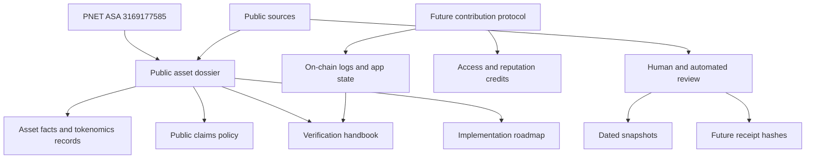
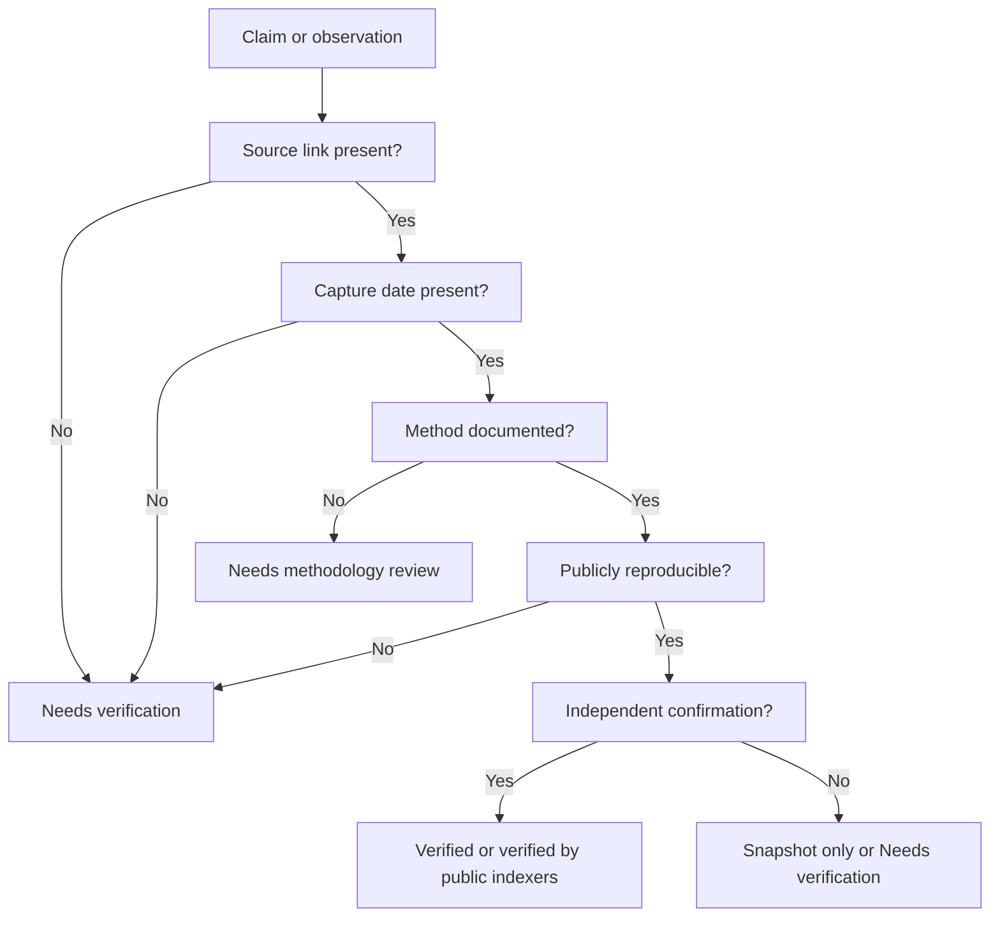

# PNET Whitepaper v1.1

Canonical specification for ProfitNet / PNET

Status: Draft for public review
Publication date: 2026-06-27
Network: Algorand MainNet
Asset: ProfitNet / PNET
ASA ID: `3169177585`
Repository: https://github.com/testedprofit/pnet-asset-dossier
Website: https://testedprofit.com

## Status of This Document

This document defines PNET as a public market-intelligence coordination asset and verification-first documentation system for the Algorand ecosystem.

It is not an investment memorandum, listing application, bridge announcement, trading system, custody system, managed strategy, deposit product, or promise of future value. It does not claim exchange support, guaranteed liquidity, guaranteed returns, passive income, or price outcomes.

The current verified surface is limited to the PNET ASA, public source references, dated review records, and documentation in this dossier. Future protocol components are specification targets until their source, deployment record, ABI, audit status, and public verification evidence are published.

## Current Implementation Status

Status date: 2026-06-27

The current implementation surface is split into a documentation layer and separate prototype packages. This dossier remains documentation and media only.

| Component | Current status | Evidence |
| --- | --- | --- |
| PNET ASA identity | Verified by public indexers at capture round `62554271` | `data/on-chain-proofs/asset-identity-proof-2026-06-27.md` |
| Current ASA control fields | Manager, reserve, freeze, and clawback reported as Algorand zero address at capture round | `data/on-chain-proofs/asset-identity-proof-2026-06-27.md` |
| Total supply and decimals | `100,000,000` PNET, `6` decimals | `data/on-chain-proofs/asset-identity-proof-2026-06-27.md` |
| Burned supply | Not verified | `data/on-chain-proofs/burn-lock-vault-worklist.md` |
| Locked supply and vault labels | Not verified | `data/on-chain-proofs/burn-lock-vault-worklist.md` |
| Operational wallet | Address and dated PNET balance snapshot recorded; role/control model unresolved | `data/on-chain-proofs/operational-wallet-proof-2026-06-27.md` |
| Community Contribution Protocol | MVP implementation package prepared; TestNet deployment pending; no public app ID claimed | `docs/pnet-contribution-protocol/MVP.md` |
| Market-intelligence snapshot API | Draft specification | `docs/implementation/market-intelligence-api-spec.md` |
| Audit status | No professional audit report included | `docs/audit/AUDIT_TRACKER.md` |
| Deployment registry | Started; no PNET protocol app claimed live | `docs/DEPLOYMENT_REGISTRY.md` |

The reality map in `docs/WHITEPAPER_REALITY_MAP.md` should be treated as the bridge between this whitepaper and current build evidence.

## 1. Abstract

Digital-asset markets contain public data, but public data is fragmented across chains, explorers, DEX interfaces, wallets, APIs, websites, screenshots, and community claims. PNET defines a public market-intelligence coordination layer for Algorand that converts those fragments into dated, source-linked, reviewable records. The PNET ASA anchors identity; the dossier records asset facts, tokenomics methodology, public claims policy, verification checklists, and future protocol specifications. PNET's purpose is to make market intelligence easier to verify, dispute, and reuse without asking readers to trust private dashboards, private screenshots, or promotional summaries.

## 2. Problem Statement

Market participants need a way to answer basic questions about an asset:

- What is the asset?
- What chain object defines it?
- What supply and control fields exist?
- Which claims are verified, stale, or unresolved?
- Which wallets, pools, locks, and allocations require human confirmation?
- Which public APIs reproduce the observed facts?
- Which project claims should not be repeated without evidence?

Today, those answers are usually scattered.

| Current surface | Useful information | Failure mode |
| --- | --- | --- |
| Explorer | Asset parameters, account balances, transactions | Does not explain project claims or methodology |
| DEX page | Pool and route context | Market data changes quickly |
| Wallet UI | Asset and account display | Labels may be social or incomplete |
| Website | Project-controlled claims | Claims may be incomplete, stale, or promotional |
| Community post | Context and history | Hard to reproduce |
| Screenshot | Momentary evidence | Easy to strip of date, source, or context |

PNET addresses the verification gap. It does not replace independent judgment.

## 3. Why Algorand

PNET begins on Algorand because Algorand Standard Assets expose a compact, public asset model.

| Algorand property | Relevance to PNET |
| --- | --- |
| ASA ID | Provides a durable asset identifier |
| Name and unit | Provides public asset metadata |
| Total supply and decimals | Enables reproducible supply interpretation |
| Manager, reserve, freeze, and clawback fields | Enables direct control-risk review |
| Account opt-in model | Makes asset holdings and local application state explicit |
| Atomic transaction groups | Allows related receipt, access, and review actions to succeed or fail together |
| Indexer APIs | Enables public asset, balance, and transaction review |
| Low-cost application calls | Supports future receipt and contribution workflows |
| ARC standards process | Provides conventions for metadata, ABI, and ecosystem interoperability |

The design choice is narrow: use Algorand for verifiable asset identity, public state, and future receipt anchoring. PNET does not require readers to trust a website as the primary record.

Atomic transaction groups are relevant to PNET because they can bind related public actions into one all-or-nothing event: a user opt-in and reviewer decision, an access-credit use and tool receipt, or a deployment evidence record and hash anchor. PNET should use this feature as a coordination primitive, not as a custody, deposit, trading, staking, or yield mechanism. The implementation pattern is tracked in `docs/implementation/algorand-atomic-transaction-groups.md`.

## 4. PNET Specification and Purpose

### 4.1 Asset Identity

| Field | Value | Status |
| --- | --- | --- |
| Brand | testedprofit / Profitnet | Needs verification |
| Asset name | ProfitNet | Verified in prior dossier indexer review; recheck before external use |
| Unit | PNET | Verified in prior dossier indexer review; recheck before external use |
| ASA ID | `3169177585` | Verified in prior dossier indexer review; recheck before external use |
| Website | https://testedprofit.com | Public project link |
| Tokenomics page | https://testedprofit.com/pages/tokenomics/ | Public project link |
| PNET page | https://testedprofit.com/pages/PNET/ | Public project link |
| Vestige page | https://vestige.fi/asset/3169177585 | Public market reference |
| Total supply | `100,000,000` PNET | Verified in prior dossier indexer review; recheck before external use |
| Decimals | `6` | Verified in prior dossier indexer review; recheck before external use |

### 4.2 Purpose

PNET is specified for four public functions:

| Function | Description | Current status |
| --- | --- | --- |
| Asset dossier | Maintain a public source-of-truth package for asset facts, links, media, and reviews | Active documentation |
| Market-intelligence records | Preserve dated observations about supply, liquidity, holders, controls, and public claims | Active documentation; future receipts planned |
| Verification handbook | Explain how anyone can audit the system using public sources | Active documentation |
| Contribution coordination | Support future non-custodial app-local contribution credits for access and reputation workflows | TestNet starter only; not MainNet; not audited |

### 4.3 Non-Purposes

PNET is not:

- a managed trading strategy,
- a copy-trading system,
- a deposit program,
- a custody system,
- a guaranteed listing path,
- a bridge guarantee,
- a passive-income product,
- a guaranteed-return product,
- a claim that any exchange will support the asset,
- a substitute for independent legal, financial, or technical review.

## 5. System Overview

The system has two layers:

| Layer | Description | Security boundary |
| --- | --- | --- |
| Documentation layer | Public Markdown, media, JSON, dated snapshots, verification guides | Must not include secrets, wallet screenshots, signer logic, trading code, or private data |
| Protocol layer | Future Algorand applications for receipts and contribution credits | Must publish source, ABI, app ID, deployment transaction, admin policy, audit status, and verification evidence |

The documentation layer can exist without live contracts. A contract must not be described as live until the protocol-publication checklist is complete.

## 6. Token Mechanics and Utility

### 6.1 Current Token Mechanics

| Mechanic | Status |
| --- | --- |
| Fixed ASA supply | Public indexer review recorded `100,000,000` display supply; recheck before external use |
| Decimals | Public indexer review recorded `6`; recheck before external use |
| Asset controls | Prior review records indicate manager, reserve, freeze, and clawback appear cleared; independent explorer and transaction-history review still required |
| Minting | No supply-expansion mechanism exists for a fixed ASA after creation |
| Token custody by dossier | None |

### 6.2 Lost Creator Account and Burn Accounting

The project context includes a user-provided claim that the original creator wallet is unavailable and that tokens routed to or opted out through that account may be permanently inaccessible.

Public handling:

| Category | Meaning | Required evidence |
| --- | --- | --- |
| Direct burned supply | Tokens sent to a recognized burn address or otherwise proven unrecoverable by public transaction evidence | On-chain transaction set and methodology |
| Inaccessible-account supply | Tokens believed inaccessible because an account is claimed to be unavailable | Public methodology, reviewer sign-off, and clear distinction from direct burns |
| Locked supply | Tokens held by a reviewed escrow, lock, or time-bound contract | Contract/app evidence, address, terms, and unlock path |
| Circulating supply | Methodology-defined supply considered available | Formula, excluded accounts, source date, and review status |

Do not describe unavailable-account supply as verified burned supply until public evidence and methodology are recorded. Until then, the lost creator account remains `Needs verification`.

### 6.3 Current Operational Wallet

User-provided operational wallet:

`CIVTUU6KLTYO26SPVEBDFBKP3UMZM2DPEO5RINODUVCI5NVIFC6HVNWS7E`

Public status: `Needs verification`.

Before this wallet is used in public diligence, the dossier should record:

- role,
- network,
- public balance source,
- movement summary,
- relationship to any application,
- control model,
- security status,
- reviewer and capture date.

No recovery words, private custody notes, personal device notes, wallet screenshots, or signer details should be published.

### 6.4 Utility Model

PNET utility is specified conservatively.

| Utility area | Safe framing | Current status |
| --- | --- | --- |
| Market-intelligence namespace | PNET identifies the asset and public dossier scope | Active documentation |
| Public review coordination | PNET documentation organizes asset facts, claims, sources, and verification work | Active documentation |
| Contribution credits | Future app-local records may support access and reputation workflows | TestNet starter only |
| API access policy | Future access tiers may reference contribution status or public usage policy | Planned; not live |
| Receipt anchoring | Future snapshots may be hashed and anchored on-chain | Planned; not live |

Contribution credits are not PNET tokens, deposits, yield, passive income, profit share, dividends, guaranteed value, or claims on treasury assets.

### 6.5 Contribution-Based Utility Mechanics

The contribution model is the first concrete utility specification for PNET-aligned tooling. It is designed around non-custodial participation records rather than financial return mechanics.

| Mechanic | Description | Evidence required before live claim |
| --- | --- | --- |
| Opt-in | User opts into an Algorand application local state | TestNet app ID and deployment record |
| Credit assignment | Admin or approved partner assigns app-local credits with reason code and receipt hash | ABI, source, logs, action-code registry |
| Gifting | User may gift app-local credits to another opted-in user | Test report and public method docs |
| Credit use | User may use credits for documented access/reputation purposes | purpose-code registry and receipt policy |
| Public verification | Anyone can inspect app state, logs, and receipt hashes | indexer query examples and monitoring report |

The full build specification is maintained in `docs/implementation/community-contribution-protocol-spec.md`.

## 7. Market-Intelligence Model

### 7.1 Definition

Market intelligence is a dated, source-linked, reproducible statement about an asset, market, wallet, route, claim, or system behavior.

### 7.2 Record Types

| Record type | Purpose |
| --- | --- |
| Asset fact | ASA identity, supply, decimals, URL, creator, and control fields |
| Tokenomics snapshot | Public-page claims, supply categories, lock labels, and status labels |
| Market snapshot | Dated liquidity, pool, routing, volume, or market-page observations |
| Public claim record | A claim from project pages, third-party pages, or community materials |
| Verification receipt | Future hash-linked record of source, date, value, method, and status |
| Contribution record | Future on-chain app state for app-local contribution credits |

### 7.3 Claim Status Labels

| Label | Meaning |
| --- | --- |
| Verified | Source, date, method, observed value, and reviewer are recorded |
| Verified by public indexers | Two public indexer responses matched at capture time |
| Snapshot only | Observed on a date, but may no longer be current |
| Needs verification | Recorded but not independently confirmed |
| Needs on-chain verification | Requires explorer, indexer, transaction, account, app, or pool evidence |
| Needs methodology review | A source reports a value, but the calculation method is not documented |
| Not claimed | The dossier intentionally makes no claim |

## 8. Verification and Transparency Model

The dossier is the public source of truth for review status, not for unquestioned facts. A reader should be able to reproduce every material statement from public sources.

Transparency requirements:

- use public links,
- include capture dates,
- mark stale data,
- preserve uncertainty,
- record reviewer limitations,
- keep changelog entries,
- quarantine risky wording,
- reject private screenshots as primary evidence,
- publish source, ABI, app IDs, transaction IDs, and audit status for any future contract.

## 9. Public APIs and Data Sources

PNET documentation may reference read-only public APIs. It must not include API keys, cookies, bearer tokens, signer code, transaction-submission logic, or trading automation.

| Source | Use |
| --- | --- |
| Algonode Indexer | ASA metadata, balances, transactions |
| Nodely Indexer | ASA metadata, balances, transactions |
| Lora | Human-readable Algorand explorer review |
| Pera Explorer | Wallet/explorer asset review |
| Allo | Asset explorer reference |
| Vestige | Asset, market, and routing reference |
| Tinyman | Pool and analytics reference when available |
| Pact | Pool and analytics reference when available |
| ASAstats | Account and asset context when available |
| Folks / routing data | Route context when publicly available |

See `docs/11_API_AND_DATA_SOURCES.md` and `data/api-sources/pnet-api-sources.md`.

## 10. Contribution Protocol Specification

The PNET Community Contribution Protocol is a planned non-custodial Algorand application for app-local contribution credits.

Approved one-sentence description:

> The PNET Community Contribution Protocol is a non-custodial Algorand application for app-local contribution credits that may support access and reputation features for approved ecosystem participation.

### 10.1 Intended Features

| Feature | Description | Public status |
| --- | --- | --- |
| Opt-in | User opts into application local state | TestNet starter only |
| Credit assignment | Admin or approved partner assigns app-local credits with public reason code and receipt hash | TestNet starter only |
| Gifting | Opted-in user may transfer app-local credits to another opted-in user | TestNet starter only |
| Credit consumption | User may consume credits for access or reputation purposes | TestNet starter only |
| Pause control | Admin may pause state-changing methods | TestNet starter only |
| Public verification | App state, logs, and receipt hashes should be inspectable from public indexers | Required before live claim |

### 10.2 Safety Invariants

The contribution protocol must preserve these invariants:

- no custody of user PNET,
- no PNET deposit requirement,
- no staking/yield logic,
- no APY/APR/ROI calculation,
- no automated trading,
- no route, swap, bridge, or exchange logic,
- no guaranteed value,
- no claim on treasury assets,
- no use of lost creator wallet mechanics inside the protocol.

### 10.3 Publication Gate

No contribution protocol deployment should be described as live until the dossier records:

- public source repository,
- reviewed source commit,
- generated ABI,
- approval and clear program hashes,
- network,
- application ID,
- deployment transaction,
- creator address,
- admin and partner policy,
- update/delete policy,
- pause policy,
- action-code registry,
- receipt policy,
- test results,
- audit or explicit unaudited status,
- known limitations.

## 11. Implementation Roadmap

### 11.1 Phase 0: Documentation and Verification Baseline

| Milestone | Evidence |
| --- | --- |
| Public dossier organized | README, whitepaper, docs index, changelog |
| Asset facts recorded | `docs/01_ASSET_FACTS.md` |
| Tokenomics claims separated from facts | `docs/03_TOKENOMICS.md` |
| Public claims policy active | `docs/06_PUBLIC_CLAIMS_POLICY.md` |
| Verification handbook published | `docs/verification/VERIFICATION_HANDBOOK.md` |

Exit criteria: a public reviewer can understand what is verified, what is unresolved, and how to reproduce checks.

### 11.2 Phase 1: TestNet Contribution Credits

| Milestone | Evidence |
| --- | --- |
| Source published in implementation repo | Repository URL and commit |
| ABI and TEAL artifacts published | Artifact hashes |
| TestNet app deployed | App ID and deployment transaction |
| Static safety scan passed | No custody, signer, trading, or yield logic |
| Multi-wallet test completed | Public test report |
| Public claims review completed | Approved framing guide |

Exit criteria: the protocol is publicly reviewable on TestNet and still clearly not MainNet, not audited, and not live for production use.

### 11.3 Phase 2: Market-Intelligence Receipts

| Milestone | Evidence |
| --- | --- |
| Receipt schema published | Versioned schema |
| Snapshot method documented | Source, capture date, hash method |
| On-chain hash anchor tested | TestNet transaction and hash |
| Public query examples published | Read-only examples only |
| Dispute process documented | Correction and changelog policy |

Exit criteria: a third party can reproduce a snapshot, compute the same hash, and locate the public anchor.

### 11.4 Phase 3: Limited MainNet Candidate

| Milestone | Evidence |
| --- | --- |
| Professional audit or focused review complete | Report or public summary |
| Admin/update policy finalized | Immutable, multisig, timelock, or explicit admin model |
| Action-code and receipt policies finalized | Public docs |
| MainNet deployment record prepared | Template reviewed before deployment |
| Legal/public-claims review completed | Internal sign-off and public-safe wording |

Exit criteria: no unresolved high-severity risk, no misleading public claim, and every MainNet claim is supported by public evidence.

### 11.5 Phase 4: Ecosystem Integration

| Milestone | Evidence |
| --- | --- |
| Developer guide maintained | Public integration guide |
| Public API/source catalog versioned | Data-source registry |
| Monthly verification reports | Dated reports |
| Partner participation policy | Public addresses, scope, and status |
| Reviewer contribution process | Public issue/PR workflow |

Exit criteria: PNET becomes useful as a public diligence and verification surface independent of short-term market conditions.

## 12. Risks and Non-Purposes

| Risk | Description | Mitigation |
| --- | --- | --- |
| Concentration risk | Holder distribution may be concentrated | Publish dated holder snapshots and avoid minimizing concentration |
| Burn-accounting ambiguity | Lost-wallet claims may be confused with direct burns | Separate direct burns, inaccessible accounts, and locks |
| Operational-wallet uncertainty | Role and control model may be unclear | Mark `Needs verification` until source-linked review exists |
| Lock/vault claims | Website labels may not prove on-chain lock status | Require explorer/app evidence |
| Market-data staleness | Liquidity and volume can change quickly | Treat market metrics as dated snapshots only |
| Public-claims drift | Community or website copy may imply yield or value | Use claims policy and approved framing guide |
| Admin discretion | Future contribution credits may depend on admin or partner actions | Publish limits, reason codes, receipts, and partner policy |
| Upgrade risk | Future app upgrades may change behavior | Publish update/delete policy and audit status |
| API dependency | External APIs can change or disappear | Cross-check sources and preserve dated records |
| Repository compromise | Public docs could be altered | Use changelog, releases, review process, and future signed artifacts |

PNET's strongest non-purpose is execution. The dossier and market-intelligence layer are not trading tools. They should help reviewers understand evidence, not tell users what to buy, sell, bridge, lock, or hold.

## 13. Governance Philosophy

PNET governance should begin with documentation discipline:

- evidence over authority,
- public review over private assertion,
- conservative wording over promotional language,
- source-linked updates over silent edits,
- minimal mutable control,
- separate security scopes for each future contract,
- no live claim without deployment evidence.

Future governance mechanisms are unspecified until a proposal defines voter eligibility, quorum, proposal format, execution boundaries, admin interaction, emergency process, and audit path.

## 14. Conclusion

PNET should be evaluated by the quality of its public record. The useful version of PNET is not a louder asset page. It is a durable verification package: a chain identity, a documented claims policy, dated snapshots, source-linked methodology, public contribution rules, and a roadmap that refuses to treat plans as facts.

The next step is not promotion. The next step is verification: publish clearer records, test non-custodial contribution mechanics on TestNet, document every deployment artifact, and keep unresolved claims visible until the evidence exists.

## Appendix A: Complete Terminology

| Term | Definition |
| --- | --- |
| PNET | Unit name for the ProfitNet Algorand Standard Asset with ASA ID `3169177585` |
| ProfitNet | Asset name associated with ASA ID `3169177585` in prior public indexer review |
| Dossier | Public documentation and media repository for asset facts, claims, verification, and review records |
| Market intelligence | Dated, source-linked, reproducible statement about an asset, market, wallet, route, claim, or system behavior |
| Snapshot | Dated observation that may become stale |
| Receipt | Public record or future hash-linked proof of a review observation |
| Verification handbook | Public guide for reproducing asset, tokenomics, market, and contract checks |
| App-local contribution credits | Records tracked inside a contribution application for access or reputation purposes |
| Operational wallet | User-provided wallet address intended for current operations; status remains `Needs verification` |
| Inaccessible-account supply | Tokens believed inaccessible because an account is claimed unavailable; not the same as verified burned supply |
| Direct burn | Supply reduction or irrecoverability claim supported by public transaction evidence and methodology |
| Needs verification | Claim is recorded but not independently confirmed |
| Needs on-chain verification | Claim requires explorer, indexer, transaction, app, account, or pool evidence |
| Needs methodology review | A value exists, but its calculation method is not sufficiently documented |

## Appendix B: Repository Map

| Path | Purpose |
| --- | --- |
| `README.md` | Public entry point |
| `WHITEPAPER.md` | Canonical specification |
| `ROADMAP.md` | Public roadmap and implementation gates |
| `SECURITY.md` | Sensitive-material and reporting policy |
| `DISCLAIMER.md` | Non-advice and risk disclaimer |
| `docs/README.md` | Documentation index |
| `docs/user/` | User-facing verification and participation guides |
| `docs/developer/` | Developer and integration guides |
| `docs/security/` | Security, audit, and monitoring guides |
| `docs/contribution/` | Contribution protocol public documentation |
| `docs/verification/` | Verification handbook and on-chain audit workflow |
| `docs/templates/` | Public announcement and website copy templates |
| `docs/01_*` to `docs/21_*` | Dated due-diligence, tokenomics, roadmap, and protocol review records |
| `data/` | Machine-readable and dated review records |
| `references/` | Public links |
| `media/` | Public media archive |

## Appendix C: Public Verification Checklist

| Check | Status |
| --- | --- |
| ASA ID verified from public indexers | Complete in prior review; recheck before external use |
| Name/unit/decimals/supply verified | Complete in prior review; recheck before external use |
| Control fields verified | Current fields verified as zero address in `data/on-chain-proofs/asset-identity-proof-2026-06-27.md` |
| Metadata hash reviewed | TODO |
| Burn accounting methodology | TODO |
| Inaccessible-account methodology | TODO |
| Operational wallet public balance snapshot | Recorded in `data/on-chain-proofs/operational-wallet-proof-2026-06-27.md` |
| Operational wallet role and control model | TODO |
| Lock/vault evidence | TODO |
| Pool and route labels | TODO |
| Contribution protocol TestNet app ID | TODO |
| Contribution protocol audit status | TODO |
| Receipt schema | TODO |
| Signed release process | TODO |

## Appendix D: References

- Bitcoin whitepaper: https://bitcoin.org/bitcoin.pdf
- Algorand Standard Assets: https://dev.algorand.co/concepts/assets/overview/
- Algorand asset operations: https://dev.algorand.co/concepts/assets/asset-operations/
- Algorand atomic transaction groups: https://dev.algorand.co/concepts/transactions/atomic-txn-groups/
- Algorand REST APIs: https://dev.algorand.co/reference/rest-api/overview/
- Algorand Indexer lookup asset balances: https://dev.algorand.co/reference/rest-api/indexer/operations/lookupassetbalances/
- Algorand ARC repository: https://github.com/algorandfoundation/ARCs
- ARC-3: https://github.com/algorandfoundation/ARCs/blob/main/ARCs/arc-0003.md
- ARC-4: https://github.com/algorandfoundation/ARCs/blob/main/ARCs/arc-0004.md
- Tinyman documentation: https://docs.tinyman.org/
- Pact documentation: https://docs.pact.fi/
- Vestige PNET page: https://vestige.fi/asset/3169177585
- Vestige API docs: https://api.vestigelabs.org/docs
- Pera Explorer: https://explorer.perawallet.app/asset/3169177585/
- Lora: https://lora.algokit.io/mainnet/asset/3169177585
- Allo: https://allo.info/asset/3169177585

## Appendix E: Claims Requiring Independent Verification

| Claim | Current status |
| --- | --- |
| Original creator wallet is unavailable | Needs verification |
| Lost creator wallet functions as a permanent burn mechanism | Needs on-chain and methodology verification |
| 8,180,000 PNET burned | Needs on-chain verification |
| Founder allocation is locked | Needs on-chain lock verification |
| Strategic reserve is locked | Needs on-chain lock verification |
| Major September 2026 unlock details | Needs on-chain lock verification |
| Operational wallet role, balance, and control status | Needs verification |
| LP/vault labels shown on public pages | Needs on-chain verification |
| Contribution protocol MainNet deployment | Not claimed |
| Exchange listing or Coinbase support | Not claimed |

## Appendix F: Peer-Review Checklist

| Reviewer | Questions |
| --- | --- |
| Algorand engineer | Are ASA field interpretations, control-field claims, and app-state assumptions correct? |
| Security reviewer | Does any future protocol component introduce custody, signer, upgrade, or admin risk? |
| Market-structure reviewer | Are liquidity and concentration risks documented without minimizing them? |
| Exchange diligence reviewer | Are listing, bridge, and venue-support claims absent unless sourced? |
| Standards editor | Are terms stable, reusable, and defined before use? |
| Public-claims reviewer | Does the language avoid yield, passive income, guaranteed value, and investment framing? |

## What Would Satoshi Criticize?

Satoshi would likely criticize this document for relying on interpretation. Bitcoin made the ledger the primary proof system. PNET still depends on indexers, APIs, repository history, reviewer judgment, and careful wording.

That criticism is valid.

The strongest version of PNET must reduce prose dependency over time by publishing reproducible receipts, source hashes, app IDs, public transaction records, and deterministic verification methods. Until then, PNET is a disciplined public dossier and specification, not a fully trustless intelligence protocol.

That limitation must remain visible.
