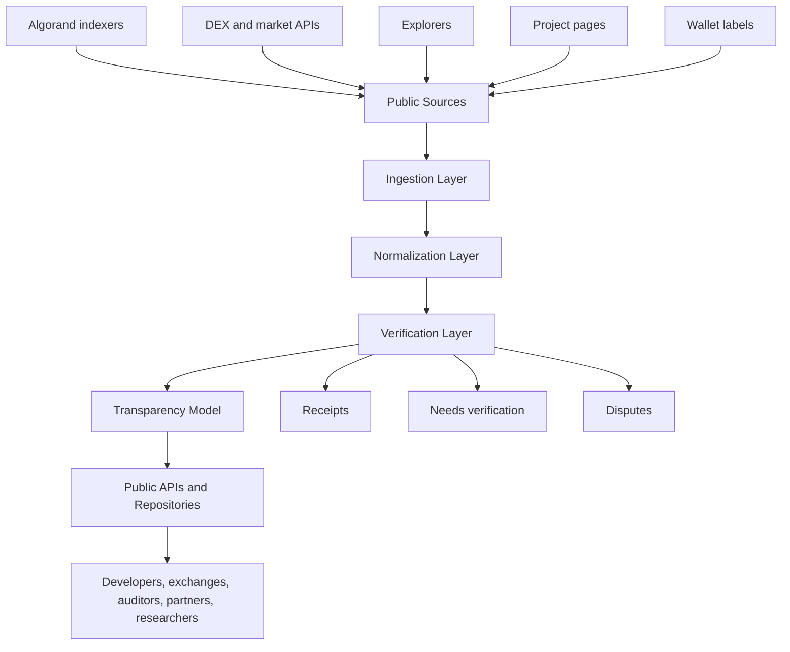
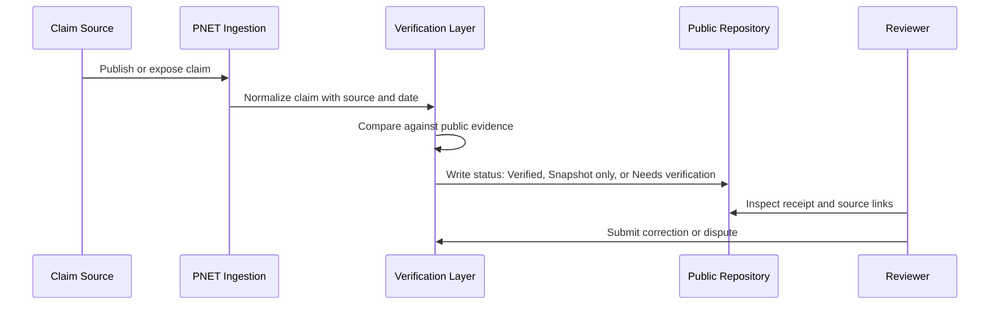
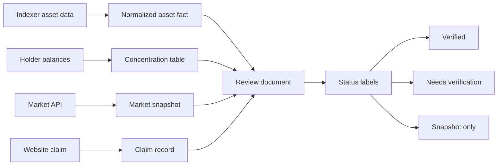
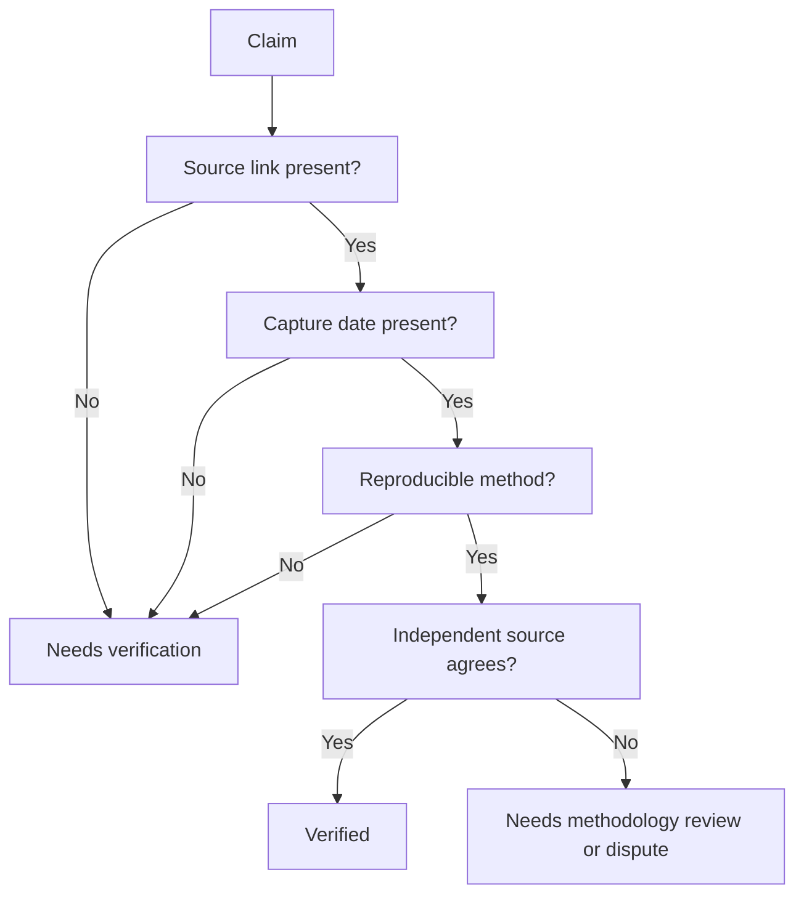
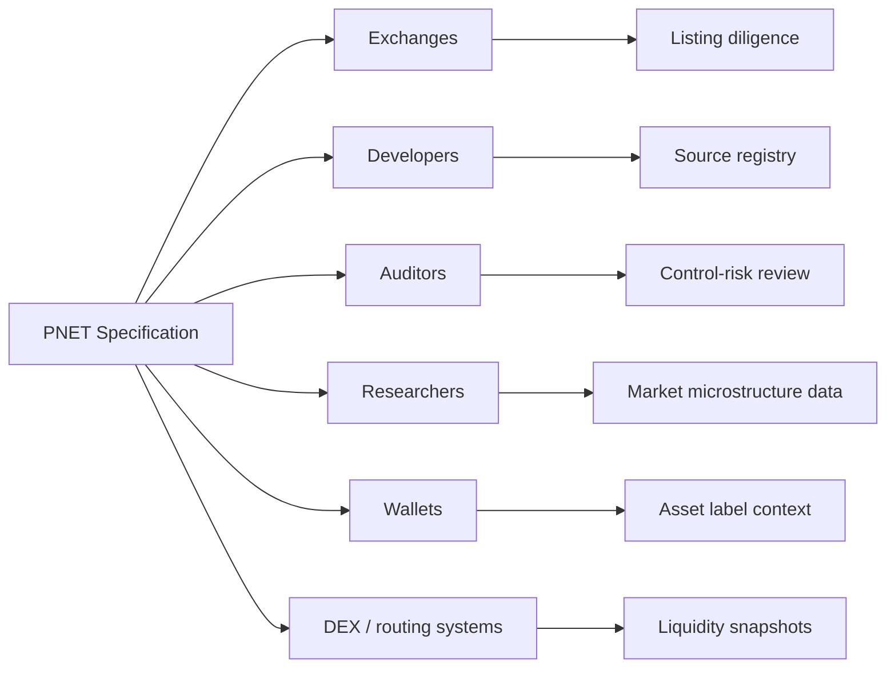
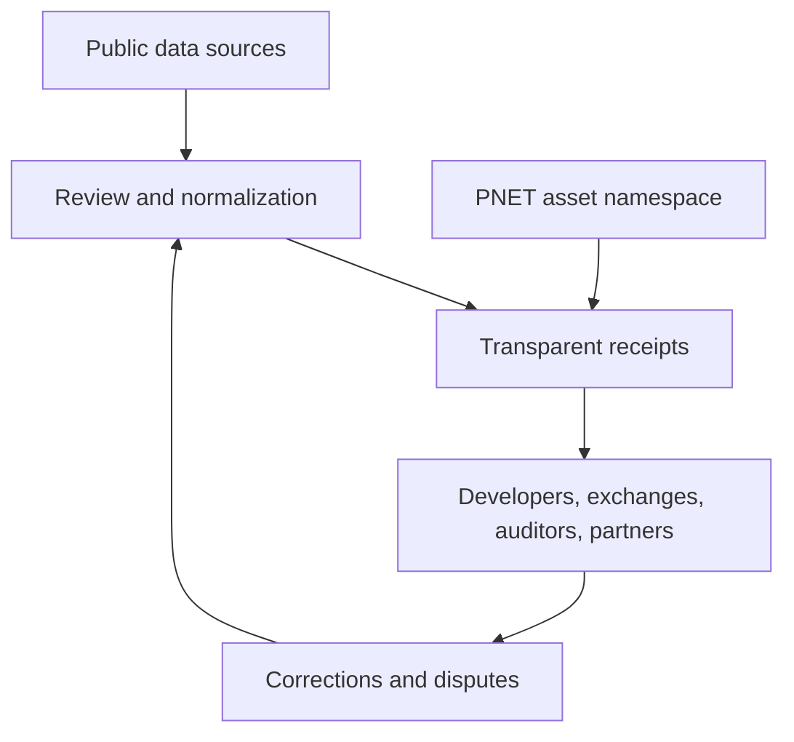

# PNET Whitepaper v1.0

Canonical Technical Specification for ProfitNet / PNET

Status: Draft for public review
Publication date: 2026-06-27
Network: Algorand MainNet
Asset: ProfitNet / PNET
ASA ID: `3169177585`
Repository: https://github.com/testedprofit/pnet-asset-dossier

## Status of This Document

This document specifies PNET as a decentralized market-intelligence system anchored by an Algorand Standard Asset. It is not an investment memorandum, listing application, price forecast, trading system, custody system, bridge specification, or promise of venue support.

The current verified implementation surface is limited to the public ASA and the documentation in this repository. Any system component not backed by source links, code, signed releases, or on-chain records is a specification target and remains subject to implementation and review.

The goal of this paper is restraint: define the problem, specify the system, state trust boundaries, and make verification possible without private access.

## 1. Abstract

Market participants need reliable intelligence about liquidity, supply, routing, asset controls, and public claims. The current environment scatters those facts across websites, explorers, decentralized exchanges, wallets, APIs, social channels, and informal community records. The result is not a lack of data. The result is a lack of verifiable synthesis.

PNET is specified as a public market-intelligence protocol for Algorand assets. Its purpose is to convert fragmented public data into auditable intelligence objects: source records, normalized observations, verification receipts, market snapshots, tokenomics records, and claim reviews. The PNET asset provides a durable coordination object for the ecosystem. The surrounding repository and future services define how the ecosystem records, verifies, and disputes market intelligence.

If Bitcoin explained how decentralized money can avoid trusted payment intermediaries, PNET explains how decentralized market intelligence can reduce dependence on opaque information intermediaries.

PNET does not remove judgment. It makes judgment inspectable.

## 2. The Market Intelligence Problem

### 2.1 Problem Statement

Digital-asset markets contain public data, but public data is not automatically public knowledge.

An asset may have:

- an on-chain asset record,
- mutable or cleared control fields,
- liquidity on several automated market makers,
- asset balances distributed across user, treasury, vault, and pool accounts,
- public claims on websites,
- market pages on third-party dashboards,
- wallet labels and community labels,
- bridges, wrappers, or representations on other networks,
- stale screenshots and outdated summaries.

The market intelligence problem is the problem of converting these incomplete records into verifiable, dated, reproducible, and non-promotional statements.

### 2.2 Why This Problem Persists

| Cause | Result |
| --- | --- |
| Data is distributed across independent systems | No single page is authoritative for all claims. |
| Market data changes continuously | Undated facts become misleading. |
| Wallet labels are often social claims | Labels require human verification. |
| Supply terms are overloaded | Total, circulating, burned, locked, vault, and liquidity supply are often conflated. |
| Listings and bridges are misunderstood | A route or wrapped asset may be mistaken for venue support. |
| Marketing language contaminates technical records | Public claims become hard to audit. |

### 2.3 Market Intelligence as a Public Good

Definition: Market Intelligence

Market Intelligence is a dated, source-linked, reproducible statement about an asset, market, wallet, route, claim, or system behavior.

Market Intelligence differs from marketing in four ways:

| Property | Marketing | Market Intelligence |
| --- | --- | --- |
| Goal | Persuasion | Verification |
| Time | Often timeless | Dated |
| Source | Selective | Linked |
| Failure handling | Minimized | Explicit |

## 3. Existing Ecosystem Fragmentation

### 3.1 Current Web2

Current Web2 market intelligence depends on private data vendors, centralized dashboards, and opaque scoring systems. These systems can be useful, but they usually require trust in the operator's data pipeline, methodology, and incentives.

### 3.2 Current Web3

Current Web3 exposes raw data but often fails to produce stable knowledge. Explorers show chain state. DEX dashboards show liquidity and volume. Wallets show labels. Projects show claims. Communities maintain context. The burden of reconciliation falls on the reader.

### 3.3 PNET

PNET specifies an intelligence layer that treats all claims as inputs. It does not grant authority to any single interface. It records claims, checks them against public evidence, marks unresolved claims, and keeps historical snapshots.

| Dimension | Current Web2 | Current Web3 | PNET |
| --- | --- | --- | --- |
| Data access | Vendor controlled | Public but scattered | Public and indexed |
| Methodology | Often opaque | Usually implicit | Documented |
| Claims handling | Editorial | Social | Verification status |
| Time handling | Variable | Often live-only | Dated snapshots |
| Dispute handling | Platform-dependent | Informal | Evidence-based review |
| Trust model | Institution | Tool and community | Source plus receipt |

## 4. Why Algorand

PNET is specified for Algorand because the intelligence layer depends on inexpensive reads, fast settlement, native assets, and a deterministic asset-control model.

### 4.1 Relevant Algorand Properties

| Algorand property | Why it matters for PNET | Source |
| --- | --- | --- |
| Native Algorand Standard Assets | Asset identity and control fields are first-class chain objects. | [ALG-ASA] |
| Immutable supply and decimals after creation | Token supply interpretation can be verified from the ASA record. | [ALG-ASSET-OPS] |
| Manager, reserve, freeze, clawback fields | Control risk can be inspected directly. | [ALG-ASA] |
| Ability to clear control addresses permanently | Renunciation claims can be verified when fields are empty or zeroed. | [ALG-ASA], [ALG-TXN] |
| Indexer REST APIs | Public observers can reproduce asset and holder queries. | [ALG-INDEXER], [ALG-ASSET-BALANCES] |
| Fast finality and no ordinary block-reorg waiting | Snapshot receipts can rely on final confirmed state rather than probabilistic confirmations. | [ALG-FINALITY], [ALG-CONSENSUS] |
| ARC standards process | Metadata and interface conventions can use ecosystem standards. | [ARC-REPO], [ARC-3], [ARC-4] |

### 4.2 Design Consequence

PNET does not need to invent an asset-control language. Algorand already exposes the relevant control fields. PNET instead specifies how those fields are read, preserved, interpreted, and cited.

### 4.3 Alternative Chains

Other chains may support richer liquidity ecosystems or larger user bases. They were not selected as the base specification because PNET's first problem is not maximum execution complexity. It is verifiable market intelligence for a specific Algorand asset. Cross-chain extensions are future work and do not imply bridge deployment or exchange support.

## 5. Why PNET Exists

PNET exists to make market intelligence inspectable.

### 5.1 Formal Purpose

PNET is a coordination asset and specification namespace for:

- public asset facts,
- tokenomics snapshots,
- holder and concentration records,
- market and liquidity observations,
- public claims review,
- API/source catalogs,
- verification checklists,
- future intelligence receipts.

### 5.2 Non-Purpose

PNET is not:

- a managed strategy,
- a custody system,
- a trading bot,
- an exchange listing claim,
- a bridge claim,
- a return claim,
- a private research terminal,
- a substitute for independent review.

### 5.3 Asset Facts

The following facts were verified in this repository from public Algorand indexer sources on 2026-06-27:

| Field | Value | Status |
| --- | --- | --- |
| ASA ID | `3169177585` | Verified by Algonode and Nodely |
| Asset name | ProfitNet | Verified by Algonode and Nodely |
| Unit | PNET | Verified by Algonode and Nodely |
| Decimals | 6 | Verified by Algonode and Nodely |
| Raw total | 100000000000000 | Verified by Algonode and Nodely |
| Display total | 100,000,000 PNET | Derived from raw total and decimals |
| URL | https://testedprofit.com | Verified by Algonode and Nodely |
| Creator | `7FRTVAZ5KCEF2CDCJACZHLLHH5QF3DTC7R4IV4KJO4K3P7TMD75ADU3Y5E` | Verified by Algonode and Nodely |
| Default frozen | false | Verified by Algonode and Nodely |

Control fields are discussed in Section 8.

## 6. Design Principles

### 6.1 Principles

| Principle | Specification |
| --- | --- |
| Public evidence first | A claim must cite a public source or remain unverified. |
| Dated records | Every observation must include capture date. |
| Minimal authority | No single dashboard is treated as complete. |
| Separation of claim and fact | A page-displayed claim is not a verified fact. |
| Reproducibility | A reviewer must be able to repeat the check. |
| Failure visibility | Unknowns are part of the record. |
| No promotion | Technical records must not contain return, listing, or price-outcome claims. |
| No private access dependency | Public review must not require private keys, internal dashboards, or secret APIs. |

### 6.2 Rejected Alternatives

| Alternative | Rejected because |
| --- | --- |
| Centralized canonical dashboard | It recreates the information intermediary problem. |
| Live-only market page | It cannot preserve historical context. |
| Social labels as facts | Labels are useful but not self-verifying. |
| Opaque scoring | Scores hide methodology and failure modes. |
| Trading integration | It changes the system from intelligence to execution. |

## 7. Architecture

### 7.1 Overview

The PNET architecture is layered.

### 7.2 Layer Responsibilities

| Layer | Responsibility | Trust boundary |
| --- | --- | --- |
| Asset Layer | Anchor PNET identity on Algorand. | Algorand consensus and indexer correctness. |
| Market Intelligence Layer | Collect public observations. | Source availability and freshness. |
| Verification Layer | Compare claims with public evidence. | Reviewer method and source quality. |
| Transparency Model | Publish records, status, and limitations. | Repository integrity and review process. |
| Public APIs | Expose read-only records. | API uptime and versioning. |

### 7.3 Sequence: Claim to Receipt

### 7.4 Data Flow

## 8. Asset Layer

### 8.1 Definition

Definition: Asset Layer

The Asset Layer is the set of on-chain facts that define PNET as an Algorand Standard Asset.

### 8.2 Asset Parameters

The Asset Layer MUST include:

- ASA ID,
- name,
- unit,
- decimals,
- total raw supply,
- URL,
- creator,
- manager,
- reserve,
- freeze,
- clawback,
- default frozen state,
- metadata hash if present.

### 8.3 Control Fields

Algorand ASAs expose control fields for manager, reserve, freeze, and clawback. Algorand documentation states that clearing control addresses permanently removes the associated capability. [ALG-ASA]

PNET's observed control fields on 2026-06-27:

| Field | Observed value | Interpretation |
| --- | --- | --- |
| Manager | zero address in indexers | Appears renounced or cleared. |
| Reserve | zero address in indexers | Appears renounced or cleared. |
| Freeze | zero address in indexers | Appears renounced or cleared. |
| Clawback | zero address in indexers | Appears renounced or cleared. |

This improves trust, but the paper still requires independent explorer confirmation and transaction-history review before relying on the claim in external diligence.

### 8.4 Design Decision

Why asset identity is on-chain:

| Question | Answer |
| --- | --- |
| Why does it exist? | A canonical identity is required for durable review. |
| Problem solved | Prevents ambiguity between project text, ticker reuse, and market-page labels. |
| Why this design | ASA metadata is public and indexable. |
| Alternative rejected | Website-only identity. It can disappear or change. |
| Tradeoff | ASA metadata is compact and cannot express the full system. |
| Security implication | Control fields must be checked, not assumed. |
| Failure case | Indexer outage or stale explorer display. |
| Future improvement | Add archived metadata records and ARC-aligned metadata receipts. |

## 9. Market Intelligence Layer

### 9.1 Definition

Definition: Market Intelligence Layer

The Market Intelligence Layer is the read-only process that converts public market data into dated observations.

### 9.2 Inputs

| Input | Example | Status model |
| --- | --- | --- |
| On-chain asset data | Algonode, Nodely | Verified when sources agree |
| Holder balances | Indexer balances endpoint | Dated snapshot |
| DEX pool data | Vestige, Tinyman, Pact | Dated snapshot |
| Market pages | Vestige web page | Dated snapshot |
| Project claims | testedprofit pages | Claim record |
| Explorer labels | Pera, Lora, Allo | Needs label confirmation |

### 9.3 Public Liquidity Signal

Definition: Public Liquidity Signal

A Public Liquidity Signal is a dated observation about available liquidity, pool balances, trading volume, route availability, or market depth from a public source.

It is not a guarantee of executable price, future depth, or route reliability.

### 9.4 Delayed Route Intelligence

Definition: Delayed Route Intelligence

Delayed Route Intelligence is routing or liquidity information published after capture. It is useful for review and research but must not be treated as live execution guidance.

### 9.5 Market Snapshot Rules

| Rule | Rationale |
| --- | --- |
| Market data MUST be dated. | Market data expires quickly. |
| Market data MUST include source. | Reproducibility requires origin. |
| Market data MUST NOT be used as a return claim. | Intelligence is not promotion. |
| Route data MUST NOT be execution advice. | Execution depends on live state and user context. |

## 10. Verification Layer

### 10.1 Definition

Definition: Verification Layer

The Verification Layer is the process that classifies claims by comparing them against public evidence.

### 10.2 Status Labels

| Label | Meaning |
| --- | --- |
| Verified | Source, date, method, observed value, and reviewer are recorded. |
| Verified by two public indexers | Two independent public indexers returned matching values. |
| Snapshot only | Observed at a date but not stable. |
| Needs verification | Recorded but not independently confirmed. |
| Needs on-chain verification | Must be checked against explorer, indexer, transaction, account, or application data. |
| Needs methodology review | Source returned a value, but the computation method is not yet documented. |

### 10.3 Transparent Receipts

Definition: Transparent Receipts

Transparent Receipts are public records that state:

- source,
- capture date,
- field checked,
- observed value,
- method,
- reviewer,
- status,
- limitations.

### 10.4 Verification Flow

### 10.5 Rejected Verification Methods

| Method | Rejected because |
| --- | --- |
| Private screenshot | Cannot be independently reproduced. |
| Community assertion | Useful context but not evidence. |
| Live dashboard only | Cannot preserve historical state. |
| Undated API response | Cannot be audited later. |

## 11. Transparency Model

### 11.1 Definition

The Transparency Model is the policy that every material statement must be linked to public evidence or marked as unresolved.

### 11.2 Transparency Objects

| Object | Location |
| --- | --- |
| Asset facts | `docs/01_ASSET_FACTS.md` |
| Tokenomics | `docs/03_TOKENOMICS.md` |
| Verification guide | `docs/04_VERIFICATION_GUIDE.md` |
| Market snapshots | `docs/05_MARKET_SNAPSHOTS.md` |
| Public claims policy | `docs/06_PUBLIC_CLAIMS_POLICY.md` |
| Deep review | `docs/12_DEEP_TOKENOMICS_REVIEW.md` |
| On-chain record | `data/on-chain-review/` |
| API sources | `data/api-sources/` |

### 11.3 Dispute Model

Disputes SHOULD be resolved by adding evidence, not by deleting inconvenient facts.

| Dispute type | Resolution path |
| --- | --- |
| Incorrect source | Add corrected source and retain changelog. |
| Stale data | Add new dated snapshot. |
| Methodology unclear | Mark Needs methodology review. |
| Wallet label disputed | Mark Needs human confirmation. |
| Public claim risky | Move to claims review and propose safer wording. |

## 12. Public APIs

### 12.1 API Role

Public APIs support reproducible review. They are not trading interfaces and not execution instructions.

### 12.2 Source Classes

| Source class | Purpose |
| --- | --- |
| Indexer APIs | Asset metadata, balances, transactions. |
| Explorer pages | Human-readable review and screenshots. |
| Market APIs | Pool, price, volume, route, lockup context. |
| Project pages | Public claims and project-controlled statements. |
| Repository files | Canonical review records. |

### 12.3 Read-Only Sources Used

| Source | Endpoint or page |
| --- | --- |
| Algonode asset endpoint | `https://mainnet-idx.algonode.cloud/v2/assets/3169177585` |
| Nodely asset endpoint | `https://mainnet-idx.4160.nodely.dev/v2/assets/3169177585` |
| Algonode holder balances | `https://mainnet-idx.algonode.cloud/v2/assets/3169177585/balances?limit=1000&include-all=false` |
| Vestige API docs | `https://api.vestigelabs.org/docs` |
| Vestige asset page | `https://vestige.fi/asset/3169177585` |
| Lora | `https://lora.algokit.io/mainnet/asset/3169177585` |
| Allo | `https://allo.info/asset/3169177585` |
| Pera Explorer | `https://explorer.perawallet.app/asset/3169177585/` |

### 12.4 API Safety

PNET API documentation MUST NOT include:

- private API keys,
- bearer tokens,
- cookies,
- session data,
- wallet credentials,
- signing logic,
- transaction submission logic,
- trading automation.

## 13. Ecosystem Integration

### 13.1 Integration Map

### 13.2 Integration Rules

| Integrator | Use PNET for | Do not use PNET for |
| --- | --- | --- |
| Exchange | Asset facts, control fields, supply review | Listing justification without independent review |
| Wallet | Asset metadata and claim status | Return or utility claims |
| DEX | Market source registry | Execution promise |
| Auditor | Checklists and evidence map | Legal opinion |
| Researcher | Dated snapshots | Live trading advice |
| Builder | Terminology and API source map | Secret-bearing integrations |

## 14. Security Model

### 14.1 Security Scope

PNET security is divided into:

- asset-control security,
- data-integrity security,
- repository integrity,
- API availability,
- public-claims safety.

### 14.2 Asset-Control Security

The observed PNET ASA control fields appear cleared. If independently confirmed, this limits future administrative changes to the ASA's manager, reserve, freeze, and clawback fields.

This does not prove:

- supply distribution fairness,
- wallet ownership,
- liquidity quality,
- lock validity,
- partner relationship validity,
- market safety.

### 14.3 Data-Integrity Security

The system's main security risk is false synthesis: correct source data can still produce incorrect conclusions.

Mitigations:

| Risk | Mitigation |
| --- | --- |
| Stale data | Dated snapshots |
| API disagreement | Multi-source comparison |
| Ambiguous labels | Needs human confirmation |
| Marketing claims | Claims policy |
| Silent revisions | Changelog |
| Private evidence | Rejected unless made public |

### 14.4 Threat Model

| Threat | Impact | Mitigation |
| --- | --- | --- |
| Website disappears | Project claims become unavailable | Repository snapshots and archives |
| API changes | Reproducibility weakens | Versioned source registry |
| Explorer displays stale data | Incorrect review | Cross-check indexers |
| Large holder moves funds | Concentration changes | New snapshot |
| Pool becomes illiquid | Market risk changes | New market snapshot |
| Malicious labels | Misclassification | Human confirmation |
| Repository compromise | False canonical docs | Signed releases and review process, TODO |

## 15. Governance Philosophy

### 15.1 Governance Target

PNET governance should govern the specification and verification process before it governs anything else.

### 15.2 Philosophy

| Principle | Meaning |
| --- | --- |
| Evidence over authority | Claims stand on source quality. |
| Minimal mutable power | The asset layer should avoid unnecessary administrative control. |
| Open review | Corrections should be public. |
| Conservative wording | Claims should understate rather than overstate. |
| Standards alignment | ARC and ecosystem conventions should be followed where applicable. |

### 15.3 Governance Not Yet Specified

No on-chain governance mechanism is specified in this paper. Future governance proposals MUST define:

- voting object,
- voter eligibility,
- quorum,
- proposal format,
- execution boundary,
- conflict handling,
- emergency process,
- audit path.

## 16. Token Utility

### 16.1 Utility Definition

Definition: Token Utility

Token Utility is the set of protocol functions for which holding or using PNET is technically required.

### 16.2 Current Status

No live token utility beyond asset identity and ecosystem coordination is independently verified in this repository as of 2026-06-27.

### 16.3 Specification Target

Future utility MAY include:

| Utility class | Description | Status |
| --- | --- | --- |
| Registry coordination | Anchor public market-intelligence records to PNET namespace. | Specification target |
| Contributor reputation | Associate reviewers with public receipts. | Specification target |
| API access policy | Define public, rate-limited, or contributor-tier access. | Specification target |
| Dispute participation | Define evidence-based dispute workflows. | Specification target |
| Ecosystem grants | Support data-source or verification work. | Specification target |

Each utility must answer:

| Question | Required answer |
| --- | --- |
| Why does it exist? | State the problem. |
| Why token-mediated? | Explain why PNET is required. |
| What alternatives were rejected? | Include non-token alternative. |
| Security implication? | State abuse case. |
| Failure mode? | State what breaks. |
| Verification path? | State public evidence. |

## 17. Tokenomics

### 17.1 Verified Supply

| Field | Value | Status |
| --- | --- | --- |
| Total raw supply | 100000000000000 | Verified by Algonode and Nodely |
| Decimals | 6 | Verified by Algonode and Nodely |
| Display supply | 100,000,000 PNET | Derived |

### 17.2 Claims Requiring Verification

| Claim | Source | Status |
| --- | --- | --- |
| Burned supply shown as 8,180,000 PNET | testedprofit tokenomics page | Needs on-chain verification |
| Founder allocation shown as 25M PNET locked | testedprofit tokenomics page | Needs on-chain lock verification |
| Strategic reserve shown as 15M PNET locked | testedprofit tokenomics page | Needs on-chain lock verification |
| Major unlock shown as 25% supply lock, Sept 2026 | testedprofit tokenomics page | Needs on-chain lock verification |
| Vestige circulating supply field | Vestige API | Needs methodology review |
| Vestige vault supply field | Vestige API | Needs methodology review |

### 17.3 Holder Concentration

The 2026-06-27 indexer review found:

| Metric | Value |
| --- | --- |
| Positive-balance rows | 164 |
| Top 1 concentration | 25.0000% |
| Top 5 concentration | 53.3871% |
| Top 10 concentration | 67.4709% |
| Top 25 concentration | 88.7874% |

This is a material concentration risk and should remain visible in diligence materials.

### 17.4 Value Flow

Value flow in the PNET ecosystem is specified as informational, not financial projection.

Value flows through usefulness:

| Participant | Contributes | Receives |
| --- | --- | --- |
| Data source | Public records | Citation and scrutiny |
| Reviewer | Verification work | Reputation and reusable evidence |
| Developer | Tools and integrations | Stable source map |
| Exchange | Diligence feedback | Cleaner listing package |
| Community | Corrections | More accurate public record |

No price outcome is specified.

## 18. Trust Assumptions

### 18.1 Assumption Table

| Assumption | Required for | Failure result |
| --- | --- | --- |
| Algorand consensus finalizes correct state | ASA metadata and balances | Incorrect on-chain base |
| Indexers serve accurate state | Public review | Bad snapshots |
| Public APIs are honestly labeled | Market records | Misclassified liquidity |
| Reviewers cite sources correctly | Receipts | False confidence |
| Repository history remains intact | Canonical record | Conflicting records |
| Readers understand status labels | Public interpretation | Overreliance |

### 18.2 Trust Minimization

PNET minimizes trust by requiring:

- public sources,
- dated captures,
- source diversity,
- status labels,
- explicit TODOs,
- dispute records.

It does not eliminate trust.

## 19. Failure Modes

| Failure mode | Description | Mitigation |
| --- | --- | --- |
| Stale market data | Snapshot no longer reflects market state. | Date all snapshots and avoid live claims. |
| False lock claim | Page says locked, but no on-chain proof is recorded. | Needs on-chain verification. |
| Misread zero address | Control field appears cleared but explorer interpretation is wrong. | Cross-check indexers and transaction history. |
| Label collision | Wallet or pool label refers to wrong entity. | Human confirmation. |
| API methodology unknown | Source returns a field without computation details. | Needs methodology review. |
| Repository drift | Docs diverge from source data. | Changelog and periodic review. |
| Scope creep | Intelligence system becomes promotional. | Claims policy and review gates. |
| Execution contamination | Read-only APIs become trading workflows. | No signing or submission logic in docs repo. |

## 20. Future Extensions

Future extensions are non-normative until separately specified.

| Extension | Purpose | Requirement before adoption |
| --- | --- | --- |
| Receipt schema | Machine-readable verification receipts | Public schema and examples |
| Reviewer identity | Associate review records with contributors | Privacy and abuse review |
| Archived snapshots | Preserve public pages and API results | Storage policy |
| Signed releases | Improve repository integrity | Key management policy |
| ARC-aligned metadata | Align asset metadata with ARC conventions | Metadata hash review |
| On-chain attestations | Anchor review receipts on Algorand | Cost, spam, and permanence analysis |
| Cross-chain records | Track bridges or representations | Explicit non-listing disclaimer |

## 21. Conclusion

PNET's purpose is not to persuade. Its purpose is to make public market intelligence easier to verify.

The system begins with a simple premise: every claim about an asset should be either source-linked, dated, and reproducible, or marked unresolved.

Algorand provides the asset layer: public identity, supply, control fields, and final settlement. PNET specifies the intelligence layer: claim records, market snapshots, verification receipts, source registries, and public review.

A useful market-intelligence system should survive website changes, dashboard changes, and market cycles. It should remain readable because it defines terms, exposes assumptions, and preserves uncertainty.

PNET should be judged by the quality of its records, not by the optimism of its language.

## Appendix A: Complete Terminology

| Term | Definition |
| --- | --- |
| PNET | Unit name for the ProfitNet Algorand Standard Asset with ASA ID `3169177585`. |
| ProfitNet | Asset name returned by public indexers for ASA ID `3169177585`. |
| Market Intelligence | A dated, source-linked, reproducible statement about an asset, market, wallet, route, claim, or system behavior. |
| Verification Layer | Process that classifies claims by comparing them against public evidence. |
| Public Liquidity Signal | Dated observation about liquidity, pool balances, volume, routing, or market depth. |
| Delayed Route Intelligence | Routing or liquidity information used after capture for review, not execution. |
| Transparent Receipt | Public record of source, date, method, observed value, reviewer, status, and limitation. |
| Snapshot only | A dated observation that may no longer be current. |
| Needs verification | A claim recorded without sufficient independent evidence. |
| Needs on-chain verification | A claim requiring explorer, indexer, transaction, account, or application proof. |
| Needs methodology review | A source returns a field, but its computation is not yet understood. |
| Asset Layer | On-chain ASA identity and control fields. |
| Market Intelligence Layer | Process that transforms public sources into normalized observations. |
| Transparency Model | Policy that material statements must cite public evidence or remain unresolved. |

## Appendix B: Public APIs

| Source | URL |
| --- | --- |
| Algonode asset endpoint | `https://mainnet-idx.algonode.cloud/v2/assets/3169177585` |
| Nodely asset endpoint | `https://mainnet-idx.4160.nodely.dev/v2/assets/3169177585` |
| Algonode balances endpoint | `https://mainnet-idx.algonode.cloud/v2/assets/3169177585/balances?limit=1000&include-all=false` |
| Vestige API docs | `https://api.vestigelabs.org/docs` |
| Vestige asset API | `https://api.vestigelabs.org/assets?asset_ids=3169177585&network_id=0` |
| Vestige asset list API | `https://api.vestigelabs.org/assets/list?asset_ids=3169177585&network_id=0&extended=true` |
| Vestige pools API | `https://api.vestigelabs.org/pools?asset_1_id=3169177585&network_id=0` |
| Vestige pools API | `https://api.vestigelabs.org/pools?asset_2_id=3169177585&network_id=0` |
| Lora | `https://lora.algokit.io/mainnet/asset/3169177585` |
| Pera Explorer | `https://explorer.perawallet.app/asset/3169177585/` |
| Allo | `https://allo.info/asset/3169177585` |

## Appendix C: On-Chain Objects

| Object | Current status |
| --- | --- |
| ASA ID `3169177585` | Verified by public indexers |
| Creator address | Verified by public indexers |
| Manager address | Appears zeroed; verify in explorer |
| Reserve address | Appears zeroed; verify in explorer |
| Freeze address | Appears zeroed; verify in explorer |
| Clawback address | Appears zeroed; verify in explorer |
| Top holder address | Verified balance; label Needs verification |
| Pool addresses | Observed in Vestige pool data; labels Need confirmation |
| Burn wallets | Needs verification |
| Lock or vault accounts | Needs verification |

## Appendix D: Repository Layout

| Path | Purpose |
| --- | --- |
| `README.md` | Public entry point |
| `WHITEPAPER.md` | Canonical technical specification |
| `DEPLOYMENTS.md` | Public references and deployment cautions |
| `SECURITY.md` | Security and sensitive-material policy |
| `DISCLAIMER.md` | Risk and non-advice disclaimer |
| `docs/` | Human-readable review and policy documents |
| `data/asset-metadata/` | Machine-readable asset facts |
| `data/tokenomics/` | Dated tokenomics snapshots |
| `data/on-chain-review/` | Dated on-chain review records |
| `data/api-sources/` | API/source registry |
| `references/` | Public links |
| `media/` | Public media archive |

## Appendix E: Deployment Philosophy

The repository is documentation and media only.

Deployment philosophy:

- no wallet logic,
- no signer logic,
- no transaction submission logic,
- no secret-bearing API integration,
- no trading automation,
- no deployment automation,
- no custody workflows.

Future deployable components MUST live in separate repositories with separate security review.

## Appendix F: Verification Checklist

| Check | Status |
| --- | --- |
| ASA ID verified from two indexers | Complete |
| Name and unit verified from two indexers | Complete |
| Decimals and total supply verified from two indexers | Complete |
| URL verified from two indexers | Complete |
| Control fields checked from two indexers | Complete |
| Control-field transaction history | TODO |
| Metadata hash | TODO |
| Burn wallets and burn amount | TODO |
| Founder allocation lock evidence | TODO |
| Strategic reserve lock evidence | TODO |
| Sept 2026 unlock mechanics | TODO |
| Pool labels and wallet labels | TODO |
| Market snapshot refresh cadence | TODO |
| Signed release process | TODO |

## Appendix G: References

[BTC] Satoshi Nakamoto, "Bitcoin: A Peer-to-Peer Electronic Cash System", 2008. https://bitcoin.org/bitcoin.pdf

[AKERLOF] George A. Akerlof, "The Market for 'Lemons': Quality Uncertainty and the Market Mechanism", Quarterly Journal of Economics, 1970. https://academic.oup.com/qje/article-abstract/84/3/488/1896241

[ALG-PAPER] Yossi Gilad, Rotem Hemo, Silvio Micali, Georgios Vlachos, Nickolai Zeldovich, "Algorand: Scaling Byzantine Agreements for Cryptocurrencies", SOSP 2017. https://eprint.iacr.org/2017/454

[ALG-ASA] Algorand Developer Portal, "Algorand Standard Assets". https://dev.algorand.co/concepts/assets/overview/

[ALG-ASSET-OPS] Algorand Developer Portal, "Asset Operations". https://dev.algorand.co/concepts/assets/asset-operations/

[ALG-TXN] Algorand Developer Portal, "Transaction Types". https://dev.algorand.co/concepts/transactions/types/

[ALG-INDEXER] Algorand Developer Portal, "Algorand REST APIs". https://dev.algorand.co/reference/rest-api/overview/

[ALG-ASSET-BALANCES] Algorand Developer Portal, "lookupAssetBalances". https://dev.algorand.co/reference/rest-api/indexer/operations/lookupassetbalances/

[ALG-FINALITY] Algorand Developer Portal, "Why Algorand?". https://dev.algorand.co/getting-started/why-algorand/

[ALG-CONSENSUS] Algorand Developer Portal, "Consensus Overview". https://dev.algorand.co/concepts/protocol/overview/

[ARC-REPO] Algorand Foundation, "Algorand Requests for Comments". https://github.com/algorandfoundation/ARCs

[ARC-3] Algorand Foundation, "ARC-3: Conventions Fungible/Non-Fungible Tokens". https://github.com/algorandfoundation/ARCs/blob/main/ARCs/arc-0003.md

[ARC-4] Algorand Foundation, "ARC-4: Application Binary Interface". https://github.com/algorandfoundation/ARCs/blob/main/ARCs/arc-0004.md

[ARC-19] Algorand Foundation, "ARC-19". https://github.com/algorandfoundation/ARCs/blob/main/ARCs/arc-0019.md

[ARC-69] Algorand Foundation, "ARC-69". https://github.com/algorandfoundation/ARCs/blob/main/ARCs/arc-0069.md

[TINYMAN] Tinyman Docs. https://docs.tinyman.org/

[PACT] Pact Docs. https://docs.pact.fi/

[VESTIGE] Vestige asset page for PNET. https://vestige.fi/asset/3169177585

[VESTIGE-API] Vestige Labs API docs. https://api.vestigelabs.org/docs

[PERA] Pera Explorer. https://explorer.perawallet.app/asset/3169177585/

[PERA-API] Pera Wallet Public API docs. https://docs.perawallet.app/references/public-api

[LORA] Algorand Foundation AlgoKit Lora repository. https://github.com/algorandfoundation/algokit-lora

[ALLO] Allo asset page for PNET. https://allo.info/asset/3169177585

## TODOs Where Evidence Is Still Required

| TODO | Evidence required |
| --- | --- |
| Metadata hash | Explorer or indexer field plus source date |
| Burned supply | Burn wallet, transaction set, or documented methodology |
| Circulating supply | Formula and source accounts |
| Founder allocation | Address, lock mechanism, unlock terms |
| Strategic reserve | Address, lock mechanism, unlock terms |
| Liquidity labels | Pool IDs and counter-asset confirmation |
| Wallet labels | Human-confirmed label records |
| Public API versioning | Versioned endpoint and schema policy |
| Signed releases | Maintainer key policy |
| Governance | Proposal and voting specification |

## Claims Requiring Independent Verification

| Claim | Current status |
| --- | --- |
| 8,180,000 PNET burned | Needs on-chain verification |
| 25M PNET founder allocation locked | Needs on-chain lock verification |
| 15M PNET strategic reserve locked | Needs on-chain lock verification |
| 25% supply lock unlocks in Sept 2026 | Needs on-chain lock verification |
| Vestige circulating supply methodology | Needs methodology review |
| Vault supply and vault lockup methodology | Needs methodology review |
| Pool wallet labels | Needs human confirmation |
| Partner allocation labels | Needs human confirmation |
| Any bridge or exchange support | Not claimed |

## Suggested Peer-Review Checklist

| Reviewer type | Questions |
| --- | --- |
| Algorand engineer | Are ASA control interpretations correct? |
| Cryptography reviewer | Are trust assumptions stated without overclaiming? |
| Market-structure reviewer | Are liquidity and concentration risks clear? |
| Exchange diligence reviewer | Are listing-related claims absent or properly disclaimed? |
| Standards editor | Are definitions stable and reusable? |
| Security reviewer | Does the repo avoid signing, custody, and secret-bearing logic? |
| Community reviewer | Are unresolved claims visible enough? |

## What would Satoshi criticize?

Satoshi would likely criticize this paper for depending on institutions of interpretation.

Bitcoin minimized the need for public explanation by making the ledger itself the primary proof system. This paper still relies on indexers, APIs, repositories, reviewers, labels, and written procedures. Those dependencies are weaker than direct protocol enforcement.

Specific criticisms:

| Criticism | Response |
| --- | --- |
| Too much prose, not enough mechanism. | Correct. The current PNET system is documentation-first. Mechanized receipts are future work. |
| Verification is social. | Partly correct. The paper reduces ambiguity but does not eliminate reviewer trust. |
| APIs can lie or disappear. | Correct. Multi-source checks and snapshots mitigate but do not solve this. |
| The token utility is underspecified. | Correct. The paper refuses to invent utility not yet implemented. |
| Market intelligence can become marketing. | Correct. The claims policy exists because this failure is likely. |
| A canonical document can become authority. | Correct. The document should be treated as a map to evidence, not evidence itself. |

The strongest version of this criticism is that PNET should move from documentation to cryptographic receipts. Until it does, the system is a disciplined public dossier, not a trustless protocol.

That limitation is acceptable only if it remains visible.
