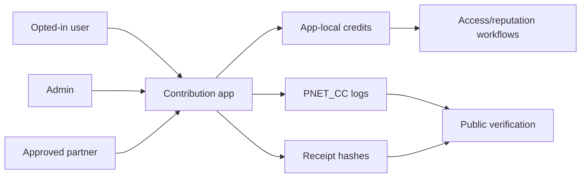

# PNET Community Contribution Protocol Guide

Status date: 2026-06-27

Current status: TestNet starter only. Not MainNet. Not audited. Not live.

## Approved Description

The PNET Community Contribution Protocol is a non-custodial Algorand application for app-local contribution credits that may support access and reputation features for approved ecosystem participation.

## What The Protocol Does

| Function | Description |
| --- | --- |
| Opt-in | A user opts into application local state |
| Credit assignment | Approved admin or partner assigns app-local credits with a reason code and receipt hash |
| Gifting | An opted-in user may send app-local credits to another opted-in user |
| Credit consumption | A user may consume app-local credits for access or reputation purposes |
| Verification | Public app state, logs, and receipt hashes support review |

## What The Protocol Does Not Do

The protocol does not:

- custody PNET,
- require deposits,
- transfer user PNET,
- create yield,
- create passive income,
- calculate APY/APR/ROI,
- promise value,
- provide investment return,
- route trades,
- bridge assets,
- claim exchange support,
- use the lost creator wallet as a protocol mechanism.

## Public Architecture



## Safe Language

| Use | Avoid |
| --- | --- |
| app-local contribution credits | rewards |
| assigned credits | earned yield |
| receive credits | passive income |
| consume credits | redeem for value |
| access/reputation features | income opportunity |
| non-custodial application | deposit program |
| TestNet prototype | live product |

## Real-World Contribution Evidence

Some contribution categories may involve external participation evidence, such as compute-participation evidence, bandwidth-sharing participation evidence, referral-campaign participation evidence, or educational proof-of-work evidence.

These categories must follow [REAL_WORLD_CONTRIBUTION_EVIDENCE.md](REAL_WORLD_CONTRIBUTION_EVIDENCE.md). The public protocol record should contain only category codes, reviewer decisions, receipt hashes, and non-sensitive notes. It should not publish raw dashboards, payout details, private wallet screenshots, personal referral identifiers, account balances, or claims that users earned value through PNET.

## Deployment Record Template

```markdown
## PNET Contribution Protocol Deployment Record

Status date:
Network:
Application ID:
Application address:
Deployment transaction:
Creator address:
Admin address:
Partner addresses:
Source repository:
Reviewed source commit:
ABI:
Approval program hash:
Clear program hash:
Action-code registry:
Receipt policy:
Update/delete policy:
Pause policy:
Audit status:
Known limitations:

Non-custodial statement:
This application does not custody user PNET, does not require user deposits, and does not provide guaranteed value, passive income, yield, or investment return.
```

## Verification Requirements

Before any live claim:

- source must be published,
- ABI must be published,
- app ID must be recorded,
- deployment transaction must be linked,
- admin and partner addresses must be documented,
- action codes must be defined,
- receipt policy must be public,
- test results must be published,
- audit status must be explicit,
- public wording must pass claims review.

Current Gate Status: CONTRIBUTION PROTOCOL GUIDE READY FOR REVIEW; MAINNET NOT APPROVED.
