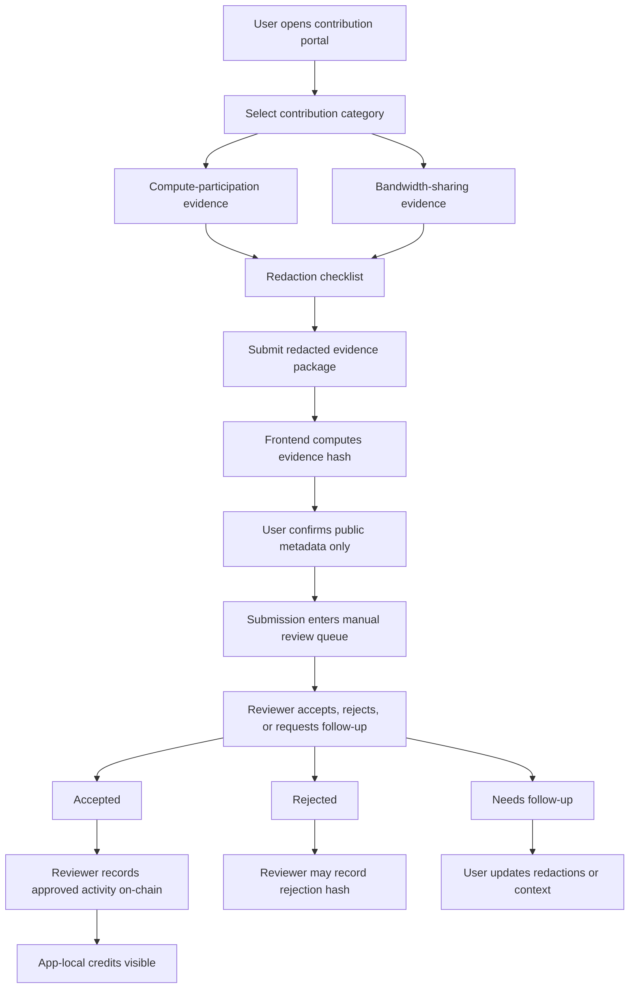

# External Activity Frontend Flow

Status date: 2026-06-27
Status: Draft UX/specification. Not live. Not audited. No production storage selected.

## Purpose

This flow supports two draft contribution categories:

- Kryptex-style compute-participation evidence.
- Honeygain / JumpTask-style bandwidth-sharing evidence.

The frontend must present these as optional contribution evidence categories for app-local access/reputation credits. It must not present them as PNET yield, profit, passive income, deposits, payouts, investment returns, or guaranteed value.

## User Flow

## Screens

| Screen | Required content | Prohibited content |
| --- | --- | --- |
| Category selection | Category label, status, safe framing, service `Needs verification` note | Income, yield, ROI, payout, or earning promise |
| Evidence checklist | Redaction requirements and accepted file types | Request for private keys, recovery words, account passwords, full wallet screenshots |
| Submission form | Category, date range, public account reference or hash, redacted file upload, consent checkbox | Payout amount field, wallet balance field, withdrawal address field |
| Review queue | Evidence hash, category, date range, privacy status, reviewer notes | Unredacted screenshots in public dashboard |
| Reviewer decision | Accept, reject, needs follow-up, reason code, credit amount within policy | Manual override without reason code |
| User result | Decision status, receipt hash, credit amount if accepted | Language implying value, yield, or future return |
| Public case study | Category, decision, hashes, privacy status, app-local credit amount | User-specific earnings, market-cap comparison, hardware profitability, payout values |
| Energy disclosure | Power-use reminder and optional user notes | Claim that mining is cost-free, renewable, or environmentally neutral |

## Submission Fields

| Field | Type | Public? | Notes |
| --- | --- | --- | --- |
| `category` | enum | Yes | `compute_participation` or `bandwidth_sharing` |
| `service_reference` | enum/string | Yes | `kryptex_style` or `honeygain_jumptask_style`; service details `Needs verification` |
| `period_code` | uint/string | Yes | Month, week, or review window code |
| `public_account_reference` | string/hash | Optional | Use only with consent; hash preferred |
| `redacted_evidence_file` | file | No | Stored only in private review queue, never committed to repo |
| `evidence_hash` | 32-byte hash | Yes | Hash of canonical redacted package |
| `privacy_attestation` | checkbox | Yes | User confirms evidence was redacted |
| `terms_attestation` | checkbox | Yes | User confirms submission follows applicable service terms |
| `energy_acknowledgement` | checkbox | Yes | User confirms compute activity can increase power use and hardware load |

## Reviewer Flow

Manual review is the first version.

1. Confirm the submission category is allowed.
2. Confirm the evidence is redacted.
3. Confirm no private wallet screenshots, balances, payout values, emails, usernames, device IDs, IP addresses, cookies, or session data are visible in any public record.
4. Confirm the public metadata matches the hash.
5. Confirm the user acknowledged power, hardware, and environmental considerations when submitting compute-participation evidence.
6. Assign a reason code and credit amount under the published policy.
7. Call the appropriate contract method:
   - `record_kryptex_activity(...)` for compute-participation evidence, or
   - `record_honeygain_activity(...)` for bandwidth-sharing evidence.
8. Record the tx ID in the public contribution receipt index.

Community review can be added later by allowing approved reviewers to co-sign review metadata before an admin/partner records the final on-chain decision.

## Contract Call Mapping

| Frontend action | Contract method | On-chain data |
| --- | --- | --- |
| Reviewer accepts Kryptex-style evidence | `record_kryptex_activity(recipient,amount,period_code,evidence_hash,review_hash)` | recipient, amount, period code, hashes |
| Reviewer accepts Honeygain-style evidence | `record_honeygain_activity(recipient,amount,period_code,evidence_hash,review_hash)` | recipient, amount, period code, hashes |
| Reviewer rejects either category | `reject_activity(recipient,activity_type,reason_code,evidence_hash,review_hash)` | recipient, activity type, reason code, hashes |

## Copy Blocks

Safe description:

> Submit redacted third-party activity evidence for manual review. Accepted submissions may receive app-local contribution credits for access and reputation workflows.

Required disclaimer:

> Contribution credits are not PNET tokens, deposits, yield, passive income, payouts, guaranteed value, or investment returns. Third-party service references are evidence categories only and do not imply partnership, endorsement, or expected outcomes.

Case study rule:

> Public examples should describe accepted contribution evidence, not user income. Do not publish earnings values, hardware profitability, net profit estimates, or comparisons to PNET market cap.

Upload warning:

> Do not upload private keys, recovery phrases, passwords, unredacted wallet screenshots, payout pages, personal identifiers, browser sessions, cookies, or account dashboards containing private details.

Energy note:

> Compute-participation activity can increase power consumption, heat, device wear, and operating cost. Users should evaluate their own setup. Renewable energy may be considered in future contribution policies, but it is not a current claim or requirement.

## Open Implementation Questions

| Question | Status |
| --- | --- |
| Where will private review files be stored before review? | Needs implementation decision |
| How long are private review files retained? | Needs privacy/legal review |
| What credit amount maps to each accepted category? | Needs published policy |
| Can service-specific evidence be reviewed under Kryptex/Honeygain terms? | Needs verification |
| Who can act as reviewer in community review phase? | Needs governance policy |
| Should renewable-energy or power-source attestations be added later? | Future roadmap; needs evidence and privacy policy |

Current Gate Status: FRONTEND FLOW DRAFTED; STORAGE, PRIVACY, REVIEWER, TERMS, AND CREDIT-MAPPING DECISIONS REMAIN BLOCKED.
