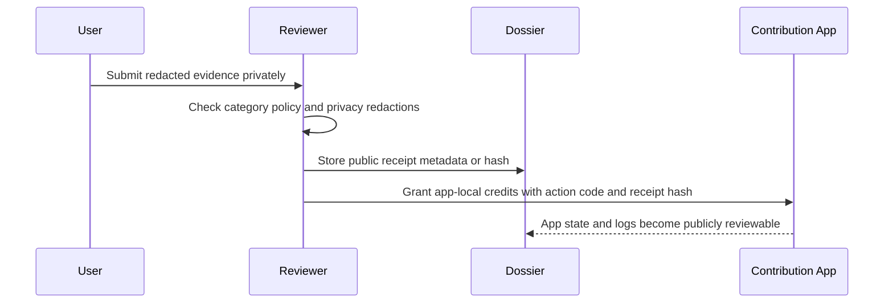

# Real-World Contribution Evidence Guide

Status date: 2026-06-27
Status: Draft policy. Not live. Not audited. Third-party service details remain `Needs verification`.

## Purpose

This guide defines how PNET may review external participation evidence for app-local contribution credits.

Approved framing:

> Users may submit redacted evidence of approved external ecosystem participation. If accepted by a reviewer, the protocol may record app-local contribution credits for access and reputation workflows.

Credits are not PNET tokens, deposits, yield, passive income, revenue share, guaranteed value, or investment returns.

## Supported Evidence Categories

These categories are candidates only. Each service, policy, and evidence format must be reviewed before use.

| Code range | Category | Examples | Public status |
| --- | --- | --- | --- |
| `700-719` | Compute-participation evidence | User-provided Kryptex-style activity evidence | Needs verification |
| `720-739` | Bandwidth-sharing participation evidence | User-provided Honeygain / JumpTask-style activity evidence | Needs verification |
| `740-759` | Referral-campaign participation evidence | Project-approved referral campaign IDs and aggregate activity receipts | Needs verification |
| `760-779` | Educational proof-of-work evidence | Guides, tutorials, support notes, or verification walkthroughs | Needs verification |

Naming rule: use the category name, not a claim that the user earned value.

## Draft Service-Specific Rules

| Service reference | Category | Evidence accepted for private manual review | Public record |
| --- | --- | --- | --- |
| Kryptex-style evidence | Compute-participation evidence | Redacted dashboard/activity screenshot and user-consented account reference or hash | Category code, review date, reviewer, decision, `evidence_hash`, `review_hash` |
| Honeygain / JumpTask-style evidence | Bandwidth-sharing participation evidence | Redacted dashboard/activity screenshot and user-consented account reference or hash | Category code, review date, reviewer, decision, `evidence_hash`, `review_hash` |

Do not publish the screenshot, payout values, full wallet address, account email, username, device details, or withdrawal details unless a separate public-disclosure policy and user consent record exist.

Public examples and website case studies must also follow [PUBLIC_CASE_STUDY_POLICY.md](PUBLIC_CASE_STUDY_POLICY.md). In particular, do not publish user-specific earnings values, hardware profitability estimates, daily averages, net profit estimates, or market-cap comparisons.

## Dual-Use Hardware and Energy Disclosure

Some contributors may use existing work, coding, IT, or learning machines for compute-participation activity. This can be reviewed as an external contribution category, but public documentation should not imply that mining is cost-free, environmentally neutral, profitable, or recommended for every user.

Approved framing:

> Some users may submit redacted evidence from existing dual-use hardware, such as a work or development PC, for manual contribution review. If accepted, the review may result in app-local contribution credits for access and reputation workflows.

Important constraints:

- Incremental GPU or CPU load can materially increase power consumption.
- Electricity cost, hardware wear, thermal impact, and environmental impact vary by user.
- Renewable energy is a future roadmap consideration, not a current requirement or claim.
- Reviewers should not publish electricity bills, hardware profitability, payout values, account balances, or private dashboard screenshots.
- Public records should use category codes, receipt hashes, reviewer decisions, privacy status, and credit amounts only.

Suggested user-facing note:

> Compute-participation activity has power and hardware costs. Users should evaluate their own electricity cost, thermal limits, device wear, and local energy mix. Contribution credits are app-local access/reputation records only and do not represent PNET yield, payout, profit, or investment return.

## Evidence Rules

| Requirement | Rule |
| --- | --- |
| Redaction | Public records must not include personal dashboards, emails, usernames, IP addresses, device IDs, private payout IDs, browser sessions, or private wallet screenshots. |
| Wallet addresses | Publish a wallet address only when the account is intentionally public and the user has consented. Prefer a short hash or reviewer-held reference. |
| Monetary values | Do not publish user-specific earnings, payout values, balances, or withdrawal screenshots. Reviewers may record only whether activity evidence passed review. |
| Referral links | Use only project-approved campaign IDs or public referral links. Do not publish personal referral IDs without consent. |
| Receipts | The public record should contain a 32-byte receipt hash, category code, review date, reviewer account, and decision. |
| Source services | Third-party service names are references to user-submitted evidence categories, not endorsements, partnerships, or guarantees. |

## Verification Flow



## Public Receipt Metadata

Public receipts should use minimal metadata.

```json
{
  "schema": "pnet-contribution-receipt-v1",
  "status_date": "YYYY-MM-DD",
  "category_code": 700,
  "category": "compute_participation_evidence",
  "reviewer": "Algorand address or documented reviewer ID",
  "decision": "accepted | rejected | needs_followup",
  "public_notes": "No private user data included.",
  "evidence_hash": "32-byte hash",
  "privacy_review": "passed | failed | needs_review",
  "verification_status": "Snapshot only"
}
```

Do not store raw screenshots, full account exports, unredacted referral pages, or device-level evidence in this repository.

## Safe Wording

| Use | Avoid |
| --- | --- |
| real-world contribution evidence | income levers |
| third-party activity evidence | proof of earnings |
| date-bounded activity summary | daily/monthly earnings claim |
| reviewer-approved contribution category | earning opportunity |
| app-local contribution credits | rewards payout |
| public receipt hash | public wallet screenshot |
| project-approved campaign ID | personal referral link dump |

## Rejection Criteria

Reject evidence if it:

- includes private keys, recovery words, credentials, cookies, or session tokens,
- includes unredacted personal identity data,
- includes private wallet screenshots or account balances,
- implies PNET value, return, yield, or payout,
- requires the reviewer to connect a wallet or sign a transaction,
- depends on a third-party service claim that has not been reviewed,
- violates the third-party service terms or user consent policy.

## Reviewer Checklist

| Check | Required result |
| --- | --- |
| Category is published | Yes |
| Service reference reviewed | Yes, or `Needs verification` |
| Screenshot redacted | Yes |
| No personal data in public record | Yes |
| No earnings/value claim in public text | Yes |
| Receipt hash generated from canonical metadata | Yes |
| Reviewer and date recorded | Yes |
| Credit amount within published limits | Yes |

## Current Open Questions

| Question | Status |
| --- | --- |
| Are Kryptex evidence formats acceptable under service terms? | Needs verification |
| Are Honeygain / JumpTask evidence formats acceptable under service terms? | Needs verification |
| Should project-managed referral campaigns be allowed? | Needs governance and claims review |
| Should any monetary amounts be reviewed privately? | Needs legal/privacy review |
| What credit amount maps to each category? | Needs public policy before deployment |
| How should public account references be hashed and rotated? | Needs implementation review |
| Should renewable-energy attestations be supported later? | Future roadmap; needs evidence policy |

Current Gate Status: REAL-WORLD CONTRIBUTION EVIDENCE POLICY DRAFTED; THIRD-PARTY SERVICE DETAILS, REFERRAL POLICY, AND CREDIT MAPPING REMAIN NEEDS VERIFICATION.
