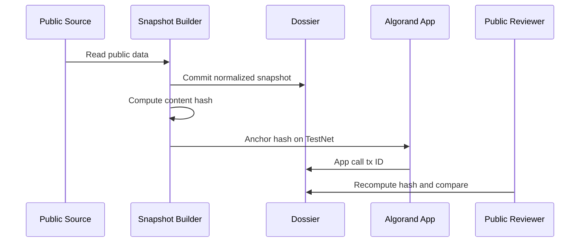

# PNET Developer Guide

Status date: 2026-06-27

This guide explains how developers should integrate with PNET documentation and future protocol components.

The dossier repository is documentation and media only. Executable code, contract source, deployment scripts, signer logic, private configuration, and frontend transaction code belong in a separate implementation repository with its own security policy.

## Integration Principles

| Principle | Requirement |
| --- | --- |
| Read-only first | Prefer public API reads and source links before writing state |
| No secrets | Do not commit API keys, mnemonics, private keys, cookies, or `.env` files |
| No custody by default | Do not introduce deposit, escrow, transfer, or signer flows without separate audit scope |
| Status labels | Preserve `Needs verification` labels in downstream interfaces |
| Dated data | Treat market metrics as stale snapshots unless refreshed |
| Public reproducibility | Publish source, hashes, app IDs, deployment txs, and ABI for any live component |

## Public Source Map

| Source | Use |
| --- | --- |
| Algonode Indexer | ASA metadata, balances, transactions |
| Nodely Indexer | Independent indexer comparison |
| Lora | Human-readable explorer review |
| Pera Explorer | Wallet/explorer asset reference |
| Allo | Asset explorer reference |
| Vestige | Market and route reference |
| Tinyman | Pool reference when PNET pools are available |
| Pact | Pool reference when PNET pools are available |
| Repository data files | Dated review records and machine-readable metadata |

## Future Receipt Pattern

The recommended first implementation pattern for market-intelligence receipts is:

1. collect public source data,
2. normalize fields,
3. write a human-readable snapshot,
4. write a machine-readable JSON record,
5. compute a content hash,
6. anchor the hash on TestNet first,
7. publish the transaction ID and source commit,
8. mark the receipt as TestNet until reviewed.

## Contribution Protocol Integration

The planned PNET Community Contribution Protocol uses app-local credits. Developers should describe these as access/reputation records, not payouts.

Required public metadata for any integration:

- network,
- app ID,
- app address,
- source commit,
- ABI,
- method table,
- action-code registry,
- receipt policy,
- admin/partner policy,
- update/delete policy,
- pause policy,
- audit status.

## Atomic Transaction Group Guidance

Algorand atomic transaction groups can be used for PNET when two or more public actions must succeed or fail together. Use them for coordination, not for hidden custody.

Preferred PNET patterns:

- user opt-in plus reviewer decision,
- app-local credit use plus tool-access receipt,
- sponsor-paid network fee plus user app call,
- deployment evidence plus hash-anchor receipt.

Do not use atomic groups to introduce contribution deposits, automatic financial rewards, trading routes, staking, or yield. Any grouped-transaction integration must publish its exact group shape, expected signers, app IDs, asset IDs, amount rules, TestNet evidence, and audit status.

## Prohibited Integration Claims

Do not describe an integration as:

- staking,
- yield,
- passive income,
- APY/APR,
- guaranteed value,
- profit share,
- holder dividend,
- exchange listing path,
- bridge listing path,
- deposit-and-earn flow.

## Developer Release Checklist

| Check | Required before public release |
| --- | --- |
| Source published | Public repository and commit hash |
| ABI published | Machine-readable ABI and method docs |
| Artifact hashes published | Approval and clear program hashes |
| Deployment record published | Network, app ID, app address, tx ID |
| Admin policy published | Admin, multisig, timelock, immutable, or explicit upgrade model |
| Tests published | Unit, negative, integration, and static safety results |
| Claims reviewed | No yield, income, deposit, listing, or guaranteed-value framing |
| Audit status published | Unaudited, reviewed, audited, or blocked |
| Atomic group shape published | Required if grouped transactions are used |

Current Gate Status: DEVELOPER GUIDE READY FOR REVIEW; LIVE INTEGRATION CLAIMS NOT APPROVED.
