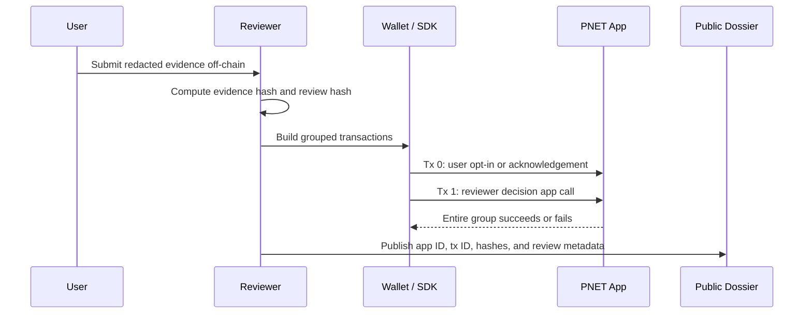

# Algorand Atomic Transaction Groups For PNET

Status date: 2026-06-27
Status: Draft implementation pattern. Documentation only.
Scope: PNET market-intelligence receipts, contribution credits, access checks, and future tool integrations.

This note explains how Algorand atomic transaction groups can be used in PNET systems without introducing custody, deposits, staking, yield, trading automation, or investment-return claims.

## Source Basis

Algorand supports atomic transaction groups as a native transaction feature. The Algorand Developer Portal describes atomic transfers as groups of transactions submitted as one unit where the whole batch either passes or fails. It also describes grouped transactions as ordered sets with a shared group ID, mixed transaction types, and pooled transaction fees.

Primary reference:

- Algorand Developer Portal: [Atomic Transaction Groups](https://dev.algorand.co/concepts/transactions/atomic-txn-groups/)

Implementation teams should verify the current transaction-group size limit and AVM behavior against official Algorand documentation before deployment.

## Definition

**Atomic Transaction Group**

An Algorand transaction group is an ordered set of transactions submitted together. The group has all-or-nothing semantics: if every transaction is valid, the group can be confirmed; if any transaction fails, the group is rejected.

For PNET, atomic groups are a coordination primitive. They are not a tokenomics feature and do not imply yield, deposits, custody, trading, or guaranteed value.

## Why This Matters For PNET

PNET's public design depends on verifiable coordination:

- proof hashes should match review decisions,
- access-credit actions should match the user action they authorize,
- tool usage records should match the fee or authorization model, if any,
- receipt anchors should be reproducible from public records.

Atomic groups let PNET bind related actions together at the Algorand protocol level instead of relying on off-chain promises that one action will follow another.

## PNET Usage Patterns

| Pattern | Group shape | Why it exists | Status |
| --- | --- | --- | --- |
| User opt-in plus reviewer action | User app opt-in + reviewer review/credit app call | Avoids a reviewer action failing because the user has not opted in | Future TestNet pattern |
| Credit use plus gated tool action | Contribution app credit-consumption call + tool app/API access receipt call | Ensures access-credit use and the gated action are recorded together | Future TestNet pattern |
| Fee sponsorship | Sponsor payment for fees + user app call | Allows a sponsor to cover network fees without custody of user assets | Future TestNet pattern |
| Readiness attestation | Deployment app call + hash-anchor app call | Records source/artifact hash and deployment evidence as one public event | Future TestNet pattern |
| Optional tool/API fee | Explicit payment/ASA transfer + access receipt app call | Records paid tool access only if the explicit payment succeeds | Requires separate audit and claims review |

The Contribution Credit System MVP should not require user deposits. Any future payment or ASA-transfer group must be scoped as a separate audited tool-access feature, not as contribution-credit issuance.

## Recommended Contribution Protocol Pattern

For the MVP, the safest atomic pattern is not a value-transfer pattern. It is an evidence-and-state pattern.

Example group:

| Index | Transaction | Signer | Purpose |
| --- | --- | --- | --- |
| `0` | User opt-in or user acknowledgement app call | User | Establishes user participation or acknowledges reviewed terms |
| `1` | Reviewer `record_kryptex_activity`, `record_honeygain_activity`, or `reject_activity` app call | Admin/partner reviewer | Records the reviewed evidence hash and decision |

Contract checks should verify:

- exact group size,
- expected transaction order,
- expected transaction types,
- expected sender for each transaction,
- no rekeying,
- no close-out fields,
- no unexpected asset or payment movement,
- expected application ID,
- expected method selector where applicable.

## Recommended Tool-Access Pattern

If a future PNET tool requires app-local contribution credits for access, use atomic grouping to prevent split outcomes.

Example group:

| Index | Transaction | Signer | Purpose |
| --- | --- | --- | --- |
| `0` | Contribution app `redeem` or `consume_access_credit` call | User | Uses app-local credits for a documented purpose |
| `1` | Tool app receipt/hash-anchor call | User or tool admin | Records the specific tool action, access period, or receipt hash |

The group should fail if the user lacks credits, the purpose code is unsupported, the receipt hash is malformed, or the tool receipt does not match the expected access action.

## Optional Payment Pattern

PNET may eventually support explicit payments for premium dashboards, APIs, or tools. If this is implemented, atomic groups can bind the payment and access receipt together.

Example group:

| Index | Transaction | Signer | Purpose |
| --- | --- | --- | --- |
| `0` | Explicit payment or ASA transfer to a published treasury/tool address | User | Pays a documented tool/API fee |
| `1` | Access receipt app call | User | Records the specific access entitlement or receipt hash |

Required safeguards:

- publish the treasury/tool address before use,
- use exact amount and asset checks,
- require `close_remainder_to` / `asset_close_to` to be zero,
- require `rekey_to` to be zero,
- reject extra transactions by checking group size,
- document that this is a tool/API fee, not a deposit, not staking, not yield, and not an investment product.

This pattern is outside the Contribution Credit System MVP.

## Reviewer Checklist For Grouped Transactions

| Check | Requirement |
| --- | --- |
| Group size | Exact expected size, not "at least" |
| Order | Exact expected index for each transaction |
| Type | Payment, asset transfer, app call, or opt-in type must match the design |
| Sender | Sender must match user, reviewer, sponsor, or admin as specified |
| Receiver | Receiver must match published address for any payment pattern |
| Amount | Exact or bounded amount must be checked for any payment pattern |
| Asset ID | Exact asset ID must be checked for ASA-transfer patterns |
| Rekey | Every grouped transaction should reject non-zero `rekey_to` unless explicitly justified |
| Close-out | Payment and ASA transfer close fields should be zero |
| App ID | App calls should reference expected application IDs |
| Method selector | ABI method selector should match the intended action |
| Logs | App calls should emit stable receipt logs where possible |

## Safe PyTeal-Style Check Pattern

This is a documentation pattern, not deployment-ready code:

```python
# Pattern only. Verify against the current Algorand AVM/PyTeal version before use.
Assert(Global.group_size() == Int(2))
Assert(Txn.group_index() == Int(1))
Assert(Gtxn[0].type_enum() == TxnType.ApplicationCall)
Assert(Gtxn[0].sender() == Txn.accounts[1])
Assert(Gtxn[0].rekey_to() == Global.zero_address())
Assert(Txn.rekey_to() == Global.zero_address())
```

Payment or ASA-transfer patterns require additional receiver, amount, asset ID, and close-field checks.

## Mermaid Flow



## Rejected Patterns

| Pattern | Reason rejected for MVP |
| --- | --- |
| Contribution deposit plus credit issuance | Creates user-deposit framing and regulatory/public-claims risk |
| Credit issuance tied to PNET transfer | Could be misread as buying credits or earning token value |
| Automatic financial reward after proof submission | Could imply yield, income, or investment return |
| DEX route execution inside contribution protocol | Introduces trading logic outside the safe scope |
| Hidden sponsor or treasury payment | Reduces transparency and complicates review |

## Required Documentation Before Use

Before any grouped-transaction pattern is used publicly, publish:

- group purpose,
- transaction order,
- expected transaction types,
- signer roles,
- app IDs,
- asset IDs if any,
- payment receiver if any,
- amount rules if any,
- source and ABI,
- TestNet app ID and tx IDs,
- public claims review,
- security review status.

Current Gate Status: ATOMIC GROUP PATTERN DOCUMENTED; TESTNET IMPLEMENTATION, AUDIT, AND PUBLIC CLAIMS REVIEW REQUIRED BEFORE PUBLIC USE.
